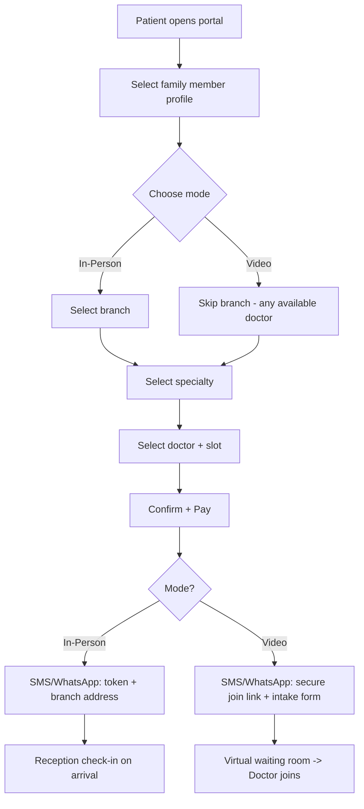
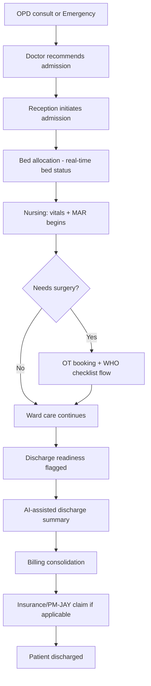
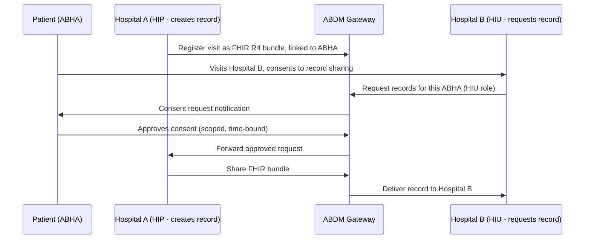

# Hospital Management System (HMS) — Full System Blueprint
### Multi-Branch, Multi-Specialty Hospital Group — India
### Enterprise Edition — Implementation-Ready

*Compiled from current (2026) HMS product research: global platforms (Epic, Oracle Health, MEDITECH, NextGen), India-specific HMIS/ERP vendors, the open-source Bahmni/OpenMRS stack, and live regulatory frameworks (ABDM, NABH 6th Edition, PM-JAY/NHCX, DPDP Act 2023, Telemedicine Practice Guidelines, CERT-In, Biomedical Waste Management Rules). This edition adds the statutory layer, specialty clinical templates, field-level schema, API contracts, key user-journey flows, scalability architecture, and a FAANG/MAANG-grade folder structure — plus a ready-to-use agent build prompt at the end.*

---

## Table of Contents

1. System Overview
2. Multi-Branch Architecture
3. Patient & Family Account Management
4. Appointment Engine — In-Person & Video Consultation
5. AI & Intelligence Layer
6. Roles, Panels, Functions & Features
7. Specialty-Specific Clinical Templates
8. Full Module Index — The Complete System
9. Database Schema — Field-Level Detail
10. API Contract & Conventions
11. Screen & Flow Design — Key User Journeys
12. Suggested Tech Stack
13. Integrations Required
14. Scalability & Zero-Flaw Architecture
15. Enterprise Folder Structure — FAANG/MAANG Engineering Standard
16. Reference Landscape — Products & Open-Source Worth Studying
17. Compliance & Security — India Context (Regulatory + Statutory)
18. Non-Functional Requirements
19. Pre-Coding Checklist
20. Agent Build Prompt — Ready to Use
21. Sources Consulted

---

## 1. System Overview

A multi-branch, multi-specialty HMS is a single platform coordinating **patients, clinical staff, administration, finance, and logistics** across every branch and every department (OPD, IPD, OT, ICU, Lab, Radiology, Pharmacy, Blood Bank, Emergency). Five principles hold the whole system together:

- **One patient, one EMR** — regardless of branch
- **One hospital group, many branches** — centrally governed, locally operated
- **One family, linked profiles** — patients manage their own and their household's records
- **One appointment engine, two delivery modes** — in-person and video consultation, same pipeline
- **One codebase, evolvable architecture** — built as a well-bounded modular monolith today, splittable into services as real load demands it, not before

2026 hospital software runs on **HL7 FHIR R4 as the integration baseline, cloud-native or hybrid deployment, and an AI intelligence layer** sitting across clinical and operational data. This blueprint builds for that bar, and for the legal/statutory reality of running a hospital in India — not just the software feature list.

---

## 2. Multi-Branch Architecture

**Model:** Single centralized system, multi-branch aware — one codebase, one database, one shared patient master.

### Core Principles
- Every operational record (appointment, admission, invoice, staff, stock) tagged `branch_id`
- **Global Patient ID** — recognized instantly at any branch, full history pulled up
- **Branch-scoped roles** — clinical/support staff see only their branch's queue, beds, stock
- **Super Admin** — full cross-branch visibility; **Branch Admin** — full control within one branch only

### Cross-Branch Capabilities
1. Unified patient search across the group
2. Cross-branch appointment booking (any doctor, any branch, from one interface)
3. Inter-branch referral with EMR summary carried forward
4. Inter-branch inventory/pharmacy stock transfer
5. Centralized billing rollup + per-branch P&L
6. Shared staff directory, multiple branch assignments, separate schedules per branch
7. Centralized master data (drug formulary, test catalog, price lists) with branch-level overrides
8. Branch comparison dashboard (occupancy, revenue, satisfaction, TAT) for Super Admin

### Data Architecture
- **Recommended:** single PostgreSQL instance, `branch_id` foreign key everywhere, row-level security or app-layer filtering
- **Only at large scale** (50+ branches, or independent-uptime requirements): separate DB per branch + a central hub DB for patient master and sync
- Start single-DB — it keeps "one patient, one record" trivially true

---

## 3. Patient & Family Account Management

Two complementary patterns:

### Pattern A — Guardian-Managed Family Group
- **Primary Account Holder** self-registers (phone/email + OTP)
- **Linked Dependents** — spouse, children, parents — each gets a full independent patient ID/EMR, accessed through the primary's login
- Used for minors and dependent elderly who cannot hold their own login
- A dependent can later **"graduate"** to their own independent login, carrying their EMR history

### Pattern B — Reciprocal Shared Access
- An adult patient owns their account and **grants viewing access** to chosen family members/caregivers — scoped and revocable by the patient themselves, not the same as guardian control

### Features
- "Add Family Member" flow: name, DOB, relationship, gender, optional ID proof
- Profile switcher — 6–10 profiles per account
- Consolidated family calendar, consolidated or split billing
- Per-member record: vaccination history, chronic condition tracking, allergy list, past surgeries
- Shared emergency contacts, per-member notification routing
- Family medical history flagged to doctors during consultation
- ICU/IPD family engagement portal (bedside view, care-team info, preference logging)

### Compliance Note (India)
A clinical establishment may process a minor's health data without separate parental consent to the extent necessary for the protection of the minor's health under the DPDP framework — the guardian-managed model is the access/UX layer; it doesn't override this clinical-necessity carve-out.

### Schema Additions
```
Family_Groups        (group_id, primary_account_id)
Family_Members        (member_id, group_id, patient_id, relationship, is_guardian_managed)
Shared_Access_Grants  (grant_id, patient_id, granted_to_user_id, scope, granted_at, revoked_at)
```

---

## 4. Appointment Engine — In-Person & Video Consultation

One unified engine. Mode is chosen at booking time; EMR, billing, and notifications stay shared downstream.

### Booking Flow
1. Select branch (in-person) or "any available doctor" (video)
2. Select specialty → doctor → slot, tagged **In-Person**, **Video**, or **Either**
3. Select which family member profile the appointment is for
4. Confirm + pay → confirmation via SMS/WhatsApp/email

### In-Person Specific
- Token/queue tied to the branch's live display board
- Reception check-in on arrival advances the doctor's live queue
- Walk-ins slot into gaps automatically; self-check-in kiosk / QR check-in optional

### Video Consultation Specific
- Pre-consult intake form; virtual waiting room; Jitsi (self-hosted) or Agora/Twilio (paid, scale)
- In-call chat, file/report sharing, screen share; low-bandwidth audio-only fallback
- Optional recording, gated on explicit logged consent
- E-prescription auto-generated and pushed to the patient portal the moment the call ends
- No-show handling → auto-reschedule or refund per policy
- Doctor can flag "in-person follow-up needed," auto-launching that booking flow

### India Telemedicine Compliance (Telemedicine Practice Guidelines, NMC 2020, as amended)
- Only a **Registered Medical Practitioner (RMP)** can conduct the consult; registration number displayed and verifiable
- Both parties identified at session start; patient age established
- **Teleconsultation for a minor requires an identified adult family member present on the call** — hard gate in the booking/join flow whenever the profile is a dependent under 18
- **Consent implied when the patient initiates**; if the hospital/doctor initiates, explicit recorded consent is required
- Certain drug schedules cannot be prescribed via teleconsultation alone — enforce this in the e-prescription module, not the doctor's memory

### Shared Backend Logic
- Single `Appointments` table: `mode` enum (`in_person`/`video`), `branch_id` (nullable for pure video)
- Both modes feed the same EMR, billing pipeline, and notification engine

---

## 5. AI & Intelligence Layer

- **Ambient clinical documentation** — doctor speaks naturally; AI drafts structured notes for review/approval
- **Predictive bed & census forecasting** — admission trends, discharge timing, seasonal patterns → proactive staffing
- **AI-assisted OR scheduling** — procedure-duration variability, surgeon patterns, sterilization turnaround, ICU capacity
- **Clinical Decision Support (CDSS)** — drug interaction/dosage checks plus risk-trajectory prediction (e.g., early deterioration flagging), with context-aware alerting to avoid alert fatigue
- **Imaging second-read** — flags suspected anomalies as a second review layer on the RIS/PACS worklist; augments, never replaces sign-off
- **Supply chain/inventory forecasting** — predicts consumable/drug demand from consumption history + seasonality
- **Conversational AI / triage chatbot** — symptom intake, appointment-mode suggestion, FAQ handling
- **Remote Patient Monitoring (RPM) ingestion** — connected devices feed vitals into the EMR between visits for chronic-condition follow-up
- **AI billing/coding assist** — flags coding errors and claim-denial risk before submission

Build each as a service reading from the core EMR/operational database, not a silo.

---

## 6. Roles, Panels, Functions & Features

### 6.1 Super Admin
**Panel:** Platform/Group Admin — branch creation & assignment; cross-branch dashboards; RBAC matrix editor; central master data with branch-override; global settings; system-wide audit logs; license management; backup/restore & export.

### 6.2 Branch Admin
**Panel:** Branch Operations — staff onboarding + roster; department/bed configuration; leave & attendance approval; branch KPIs; branch-level price overrides; notice board; branch-scoped complaint resolution.

### 6.3 Doctor Panel
**Panel:** Doctor/Consultant Dashboard — today's queue (OPD+IPD+video, mode-tagged); group-wide EMR access; e-prescription with interaction/allergy warnings and telemedicine drug-schedule enforcement; lab/radiology/procedure ordering; separate in-person/video calendars; video join + in-call tools + post-call e-prescription; admission notes & AI-assisted discharge summary; OT booking request; inter-branch referral; digital signature; CDSS risk alerts; revenue self-dashboard. **Specialty-specific structured templates load automatically based on the doctor's department (see §7).**

### 6.4 Nurse / Ward Staff Panel
**Panel:** Nursing Station — assigned patients per ward/shift; vitals entry with trend charts and early-warning scoring; MAR; nursing notes & care plan; bed transfer/discharge-readiness flagging; critical-vitals escalation; shift handover notes; ICU family-engagement portal access.

### 6.5 Receptionist / Front Desk Panel
**Panel:** OPD Registration & Front Desk — new registration or instant group-wide recognition; family registration; booking/rescheduling (in-person+video, any doctor/branch); token/queue + live display; self-check-in kiosk; IPD admission initiation; registration/advance billing; group-wide search; SMS/WhatsApp confirmations.

### 6.6 Patient Panel
**Panel:** Patient Portal / Mobile App — booking (in-person/video); family profile switcher + shared-access grants; per-member EMR with downloadable PDFs; consolidated/split billing; join video consult; ABHA linking; conversational AI chat; feedback; health/vaccination reminders; ambulance request; RPM device view.

### 6.7 Pharmacist Panel
**Panel:** Pharmacy Management — e-prescription queue; dispense with auto stock deduction; low-stock/expiry alerts; FEFO tracking; interaction/allergy warnings; inter-branch transfer requests; AI-forecasted reorder points; GST-compliant billing; consumption reports.

### 6.8 Lab Technician Panel
**Panel:** LIS — orders with STAT flag; barcode sample tracking; result entry (manual/instrument); abnormal-range flagging; signed PDF reports auto-pushed; test catalog/pricing; TAT dashboard; blood-bank transfusion-reaction linkage.

### 6.9 Radiology Panel
**Panel:** RIS + PACS — order queue with scheduling; PACS/DICOM storage (Orthanc); AI second-read flagging; reporting templates; report approval & EMR push; equipment scheduling.

### 6.10 Billing / Accounts / Cashier Panel
**Panel:** Finance & Billing — consolidated invoicing; multi-mode payment; IPD advance/deposit; refund/discount workflow; GST-compliant invoicing with e-invoicing/IRN above threshold turnover; daily reconciliation; branch-wise/group-wide revenue reports; outstanding-dues tracking; AI claim-denial flagging.

### 6.11 Inventory / Store Manager Panel
**Panel:** Central Stores — stock in-out; supplier/PO management; AI-forecasted reorder alerts; asset register cross-linked to CMMS; inter-branch transfers; consumption analytics.

### 6.12 HR & Payroll Panel
**Panel:** Human Resources — employee records with license/credential expiry tracking; multi-branch assignment; roster & biometric attendance (AEBAS where mandated); leave workflow; **statutory payroll** (PF, ESI, Professional Tax, TDS — not just gross-to-net math); performance records; recruitment/onboarding.

### 6.13 Insurance / TPA / Government Scheme Desk
**Panel:** Insurance & Cashless Desk
- **Private insurance (NHCX):** coverage-eligibility check, pre-auth/predetermination, standardized claim submission, real-time status, 3-hour post-discharge cashless settlement clock, insurer-wise outstanding dashboard
- **Government scheme (PM-JAY):** BIS beneficiary verification, TMS claim workflow, GMS grievance logging, dedicated Ayushman Mitra desk role

### 6.14 OT (Operation Theatre) Manager Panel
**Panel:** OT Scheduling & Perioperative Management — slot booking with resource allocation; block scheduling; waitlist; block-conflict warnings; **WHO Surgical Safety Checklist** enforcement (Sign In/Time Out/Sign Out); pre-op assessment & consent; intra-op + anaesthesia documentation; **implant serial tracking**; blood-transfusion log linked to Blood Bank; **Aldrete post-op recovery scoring**; CSSU coordination; Big Board patient-location view; utilization analytics.

### 6.15 Ambulance / Emergency Panel
**Panel:** Emergency & Ambulance Dispatch — GPS fleet tracking; nearest-vehicle auto-assignment; traffic-aware route optimization; geo-fencing; driver-behavior monitoring; nearest-branch routing; emergency fast-track registration; ETA push to receiving branch; trip log & billing.

### 6.16 Blood Bank Panel
**Panel:** Blood Bank Management (Drugs and Cosmetics Act / CDSCO / NACO governed) — donor registration & deferral management; bag-number traceability; mandatory HIV/HBsAg/HCV/malaria/syphilis testing pre-issue; component separation (PCV/FFP/platelets/cryoprecipitate); cross-match & issue; temperature-monitored storage; transfusion reaction reporting linked to LIS and incident reporting; blood camp management; inter-branch requisition; auto NACO-format reports.

### 6.17 Housekeeping / Biomedical Maintenance (CMMS) Panel
**Panel:** Facility & Equipment Maintenance — cleaning task/bed-turnover tracking; QR/RFID-tagged asset registry with condition scoring; PM scheduling; full work-order lifecycle with e-signed sign-off; calibration records; life-safety inspection tracking; vendor/AMC tracking; CapEx forecasting; breakdown ticketing with downtime tracking.

### 6.18 Medical Superintendent / Department Head Panel
**Panel:** Clinical Governance — department-wise load/occupancy/outcome stats; doctor performance & satisfaction metrics; clinical audit & NABH quality-indicator tracking; incident/adverse-event reporting; approval authority for high-value procedures/discounts; PROM tracking.

### 6.19 Call Center / Telemedicine Coordinator Panel
**Panel:** Patient Engagement Desk — phone-booking logging; post-discharge follow-up scheduling; video scheduling & link distribution; feedback calls; health-checkup-package/corporate-wellness outreach.

---

## 7. Specialty-Specific Clinical Templates

A single generic consultation form does not work across a multi-specialty hospital — a cardiology visit and an antenatal visit need different structured fields entirely. Do **not** hardcode a separate database table per specialty; that breaks the moment the hospital adds a 16th specialty. Instead, build **one EMR engine with a configurable clinical-forms layer**: each specialty's template is a JSON-schema-driven form definition stored in the database and rendered dynamically, so adding or editing a specialty template is a data change, not a migration.

```
Specialty_Templates (template_id, specialty_id, version, form_schema JSONB, is_active)
Consultation_Form_Data (visit_id, template_id, form_values JSONB)
```

### Representative Specialty Fields (build the template engine, then seed these)
| Specialty | Structured fields beyond the generic consult note |
|---|---|
| Cardiology | ECG findings, echo findings (ejection fraction %), cardiac risk factors, anticoagulant tracking, cath-lab referral flag |
| Obstetrics & Gynecology | LMP, EDD, gravida/para, antenatal visit schedule, fetal growth chart, ultrasound findings, partograph during labor |
| Orthopedics | Injury mechanism, X-ray findings, fracture classification, range-of-motion charting, physiotherapy plan |
| Oncology | TNM staging, chemotherapy protocol & cycle tracking, tumor board notes, radiation session log |
| Pediatrics | Growth chart (height/weight/head circumference percentile), vaccination schedule, developmental milestones |
| Nephrology / Dialysis | Dialysis session log (duration, fluid removed, vascular access site), creatinine trend |
| Psychiatry | Structured mental status exam fields, session notes, care-plan tracking — administrative fields only; no clinical risk-scoring content should be hardcoded into the software itself, that stays a clinician judgment call |
| General Surgery | Pre-op assessment, operative note, post-op orders |
| ENT / Ophthalmology / Dermatology / Gastroenterology / Pulmonology / Urology / Endocrinology | Each needs its own template — build the engine once, add these as data, not code |

### Why this matters for scale
Every specialty added later is a **template + seed data change**, never a schema migration or a redeploy. This is the single highest-leverage design decision for "handle everything without flaw" on the clinical side — it's the difference between a system that scales to 20 specialties and one that needs a developer every time the hospital opens a new department.

---

## 8. Full Module Index — The Complete System

**Core Clinical**
1. Patient Registration & Master Index (multi-branch, family-linked) · 2. OPD Management · 3. IPD / Admission-Discharge-Transfer · 4. EMR/EHR Core + Configurable Specialty Template Engine · 5. e-Prescription & Drug Database · 6. Nursing Station / MAR · 7. Vitals & Early Warning Score · 8. Bed & Ward Management · 9. OT Scheduling & Perioperative Documentation · 10. Anaesthesia Records · 11. ICU/Critical Care Monitoring · 12. AI-Assisted Discharge Summary Generator · 13. Referral Management (internal & external) · 14. Multi-Specialty Case Review / Second Opinion Board

**Diagnostics**
15. Laboratory Information System (LIS) · 16. Radiology Information System (RIS) + PACS · 17. Pathology Reporting · 18. Point-of-Care Testing Integration

**Pharmacy & Supply Chain**
19. Pharmacy Dispensing · 20. Drug Inventory & Batch/Expiry (FEFO) · 21. Central Stores / Non-Pharmacy Inventory · 22. Purchase Order & Vendor Management · 23. Biomedical Equipment CMMS · 24. Asset Registry & QR/RFID Tracking

**Blood Bank**
25. Donor Registration & Screening · 26. Collection, Component Separation & NACO-Mandated Testing · 27. Cross-Match & Issue · 28. Blood Camp Management · 29. Transfusion Reaction Reporting

**Patient & Family Experience**
30. Patient Portal / Mobile App · 31. Family Account & Dependent Management (Pattern A) · 32. Shared-Access Record Grants (Pattern B) · 33. ICU/IPD Family Engagement Portal · 34. Appointment Booking Engine (in-person + video) · 35. Video Consultation Platform · 36. Feedback & NPS Surveys · 37. Health & Vaccination Reminders

**Billing, Insurance & Government Schemes**
38. Consolidated OPD/IPD/Pharmacy/Lab Billing · 39. GST-Compliant Invoicing + e-Invoicing/IRN · 40. Private Insurance/TPA Desk + NHCX Integration · 41. PM-JAY Desk (BIS/TMS/GMS, Ayushman Mitra workflow) · 42. Corporate Empanelment & Health-Checkup Packages · 43. Revenue Cycle Management & Denial Tracking

**Workforce**
44. HR & Staff Records · 45. Shift Roster & Biometric Attendance · 46. Statutory Payroll (PF/ESI/PT/TDS) · 47. Credential/License Expiry Tracking

**Emergency & Logistics**
48. Emergency/Casualty Fast-Track Registration · 49. Ambulance Dispatch & GPS Tracking · 50. Housekeeping & Bed-Turnover Tracking

**Governance, Compliance & Intelligence**
51. Role-Based Access Control & Audit Trail · 52. ABDM Consent Manager (HIP/HIU, FHIR R4 bundling) · 53. NABH Quality Indicator & Incident Reporting · 54. Clinical Decision Support (interactions, dosage, risk alerts) · 55. AI Layer (ambient documentation, predictive census, imaging second-read, chatbot triage, RPM ingestion) · 56. Business Intelligence / MIS Dashboards (branch + group-wide) · 57. Notification Engine (SMS/WhatsApp/Email/Push) · 58. Document Management & Digital Consent Signing · 59. Inter-Branch Referral & Transfer Sync · 60. Multi-Branch Master Data & Price Governance

**Statutory & Legal Operations (new)**
61. Biomedical Waste Segregation & Disposal-Manifest Tracking · 62. Birth/Death Event Registration Feed · 63. Notifiable Disease (IDSP) Reporting · 64. Clinical Establishment Registration & Renewal Tracker · 65. Consent-Form & Legal Document Repository

---

## 9. Database Schema — Field-Level Detail

Representative core tables in PostgreSQL DDL. Every table follows the same conventions: UUID primary keys (safe for multi-branch/distributed generation), `created_at`/`updated_at` timestamps, and `deleted_at` for soft deletes — hospital records are medico-legal documents and are never hard-deleted.

```sql
-- Branches
CREATE TABLE branches (
  branch_id UUID PRIMARY KEY DEFAULT gen_random_uuid(),
  name VARCHAR(150) NOT NULL,
  code VARCHAR(20) UNIQUE NOT NULL,
  address TEXT,
  city VARCHAR(100),
  state VARCHAR(100),
  phone VARCHAR(20),
  timezone VARCHAR(50) DEFAULT 'Asia/Kolkata',
  is_active BOOLEAN DEFAULT true,
  created_at TIMESTAMPTZ DEFAULT now()
);

-- Patients (standalone per individual; family linkage is a join layer)
CREATE TABLE patients (
  patient_id UUID PRIMARY KEY DEFAULT gen_random_uuid(),
  first_name VARCHAR(100) NOT NULL,
  last_name VARCHAR(100),
  dob DATE,
  gender VARCHAR(20),
  phone VARCHAR(20),
  email VARCHAR(150),
  abha_id VARCHAR(20) UNIQUE,
  blood_group VARCHAR(5),
  address TEXT,
  emergency_contact_name VARCHAR(150),
  emergency_contact_phone VARCHAR(20),
  created_at TIMESTAMPTZ DEFAULT now(),
  updated_at TIMESTAMPTZ DEFAULT now(),
  deleted_at TIMESTAMPTZ
);
CREATE UNIQUE INDEX idx_patients_phone ON patients(phone) WHERE deleted_at IS NULL;
CREATE INDEX idx_patients_abha ON patients(abha_id);

-- Family linkage
CREATE TABLE family_groups (
  group_id UUID PRIMARY KEY DEFAULT gen_random_uuid(),
  primary_account_user_id UUID NOT NULL REFERENCES users(user_id)
);
CREATE TABLE family_members (
  member_id UUID PRIMARY KEY DEFAULT gen_random_uuid(),
  group_id UUID NOT NULL REFERENCES family_groups(group_id),
  patient_id UUID NOT NULL REFERENCES patients(patient_id),
  relationship VARCHAR(50) NOT NULL,
  is_guardian_managed BOOLEAN DEFAULT true,
  UNIQUE(group_id, patient_id)
);

-- Users & RBAC
CREATE TABLE roles (
  role_id UUID PRIMARY KEY DEFAULT gen_random_uuid(),
  name VARCHAR(50) UNIQUE NOT NULL   -- 'super_admin','branch_admin','doctor', ...
);
CREATE TABLE users (
  user_id UUID PRIMARY KEY DEFAULT gen_random_uuid(),
  role_id UUID NOT NULL REFERENCES roles(role_id),
  full_name VARCHAR(150) NOT NULL,
  phone VARCHAR(20) UNIQUE NOT NULL,
  email VARCHAR(150) UNIQUE,
  password_hash TEXT NOT NULL,
  mfa_enabled BOOLEAN DEFAULT false,
  is_active BOOLEAN DEFAULT true,
  created_at TIMESTAMPTZ DEFAULT now()
);
CREATE TABLE user_branch_assignments (
  user_id UUID REFERENCES users(user_id),
  branch_id UUID REFERENCES branches(branch_id),
  PRIMARY KEY (user_id, branch_id)
);

-- Appointments (dual-mode)
CREATE TABLE appointments (
  appointment_id UUID PRIMARY KEY DEFAULT gen_random_uuid(),
  patient_id UUID NOT NULL REFERENCES patients(patient_id),
  doctor_id UUID NOT NULL REFERENCES users(user_id),
  branch_id UUID REFERENCES branches(branch_id),   -- nullable for pure video
  mode VARCHAR(10) NOT NULL CHECK (mode IN ('in_person','video')),
  scheduled_at TIMESTAMPTZ NOT NULL,
  status VARCHAR(20) NOT NULL DEFAULT 'booked',    -- booked/checked_in/completed/cancelled/no_show
  token_number INT,
  created_at TIMESTAMPTZ DEFAULT now()
);
CREATE INDEX idx_appt_branch_date ON appointments(branch_id, scheduled_at);
CREATE INDEX idx_appt_doctor_date ON appointments(doctor_id, scheduled_at);

-- Admissions (IPD)
CREATE TABLE admissions (
  admission_id UUID PRIMARY KEY DEFAULT gen_random_uuid(),
  patient_id UUID NOT NULL REFERENCES patients(patient_id),
  branch_id UUID NOT NULL REFERENCES branches(branch_id),
  bed_id UUID NOT NULL REFERENCES beds(bed_id),
  admitted_at TIMESTAMPTZ NOT NULL DEFAULT now(),
  discharged_at TIMESTAMPTZ,
  admitting_doctor_id UUID REFERENCES users(user_id),
  status VARCHAR(20) DEFAULT 'admitted'
);

-- Beds
CREATE TABLE beds (
  bed_id UUID PRIMARY KEY DEFAULT gen_random_uuid(),
  branch_id UUID NOT NULL REFERENCES branches(branch_id),
  ward_type VARCHAR(30) NOT NULL,    -- general/icu/private/hdu
  bed_number VARCHAR(20) NOT NULL,
  status VARCHAR(20) DEFAULT 'vacant'  -- vacant/occupied/cleaning/blocked
);

-- Billing
CREATE TABLE billing_invoices (
  invoice_id UUID PRIMARY KEY DEFAULT gen_random_uuid(),
  patient_id UUID NOT NULL REFERENCES patients(patient_id),
  branch_id UUID NOT NULL REFERENCES branches(branch_id),
  total_amount NUMERIC(12,2) NOT NULL,
  gst_amount NUMERIC(12,2) DEFAULT 0,
  irn VARCHAR(100),                     -- e-invoice IRN, populated above turnover threshold
  status VARCHAR(20) DEFAULT 'unpaid',
  created_at TIMESTAMPTZ DEFAULT now()
);
CREATE TABLE payments (
  payment_id UUID PRIMARY KEY DEFAULT gen_random_uuid(),
  invoice_id UUID NOT NULL REFERENCES billing_invoices(invoice_id),
  amount NUMERIC(12,2) NOT NULL,
  method VARCHAR(20) NOT NULL,           -- cash/card/upi/insurance
  idempotency_key VARCHAR(100) UNIQUE NOT NULL,   -- prevents double-charge on retry
  paid_at TIMESTAMPTZ DEFAULT now()
);

-- Audit log — partition by month at scale
CREATE TABLE audit_logs (
  audit_id BIGSERIAL,
  user_id UUID,
  branch_id UUID,
  action VARCHAR(50) NOT NULL,
  entity_type VARCHAR(50) NOT NULL,
  entity_id UUID,
  before_data JSONB,
  after_data JSONB,
  occurred_at TIMESTAMPTZ NOT NULL DEFAULT now()
) PARTITION BY RANGE (occurred_at);
```

The remaining entities (Prescriptions, LabOrders/Results, RadiologyOrders/Reports, OT_SafetyChecklist, OT_Implants, Pharmacy_Stock, Inventory_Items, CMMS_Assets/WorkOrders, BloodBank_Units/Donors/Camps, Insurance_Claims, PMJAY_Claims, ABDM_ConsentArtifacts, Notifications_Log) follow the same conventions — UUID keys, `branch_id` scoping where applicable, soft delete, and foreign keys back to `patients`/`users`/`branches`. Generate their DDL the same way as you build each module rather than front-loading sixty table definitions before writing any code.

### Schema-Level Rules Worth Enforcing From Day One
- **No hard deletes** anywhere patient, billing, or clinical data is involved — `deleted_at` only
- **UUID, not auto-increment integers**, for anything that might ever sync across branches or services
- **`branch_id` is NOT NULL** everywhere except the handful of genuinely branch-agnostic tables (pure video appointments, family groups)
- **Idempotency keys** on every payment/billing write path
- **Partition high-volume tables** (`audit_logs`, `notifications_log`, `appointments`) by month/branch once volume justifies it — design the partition key in from the start even if you don't activate partitioning on day one

---

## 10. API Contract & Conventions

### Versioning & Structure
- All endpoints under `/api/v1/...`; breaking changes get `/api/v2/...` rather than mutating v1 under active clients
- Resource-based REST: `/patients`, `/appointments`, `/admissions`, `/billing/invoices`, `/pharmacy/stock`, `/ot/bookings`, `/blood-bank/units`, etc. — nest sparingly (`/patients/{id}/appointments`, not five levels deep)

### Standard Response Envelope
```json
{
  "data": { },
  "meta": { "page": 1, "per_page": 20, "total": 134 },
  "error": null
}
```
On failure:
```json
{
  "data": null,
  "error": { "code": "VALIDATION_ERROR", "message": "phone is required", "field": "phone" }
}
```

### Auth
- Web: JWT in HttpOnly cookie, refresh-token rotation
- Mobile: JWT via `Authorization: Bearer` header
- Every request carries the user's `role_id` and `branch_id(s)` in the token claims — the branch-scoping middleware reads from the token, never from a client-supplied field

### Pagination
- Cursor-based for high-volume/append-only resources (`audit_logs`, `notifications`, `appointments` history)
- Offset-based is acceptable for small, bounded lists (branch list, specialty list)

### Idempotency
- Every payment, billing, and claim-submission endpoint requires an `Idempotency-Key` header — a retried request with the same key returns the original result instead of creating a duplicate charge or duplicate claim

### Async & Events
- Anything that doesn't need to block the response (SMS/WhatsApp send, PDF generation, AI summarization, report generation) goes on a job queue, not inline in the request handler
- Internal event bus for cross-module triggers: `appointment.booked`, `lab_result.ready`, `payment.completed`, `admission.discharged` — modules subscribe rather than calling each other directly, which is what keeps a modular monolith splittable into services later without a rewrite

### Source of Truth
- Maintain an OpenAPI (Swagger) spec per module, versioned in the repo under `docs/api-specs/` — generate client types from it rather than hand-writing them twice

---

## 11. Screen & Flow Design — Key User Journeys

Mermaid diagrams below render natively in GitHub, VS Code, and most modern Markdown viewers — treat this section as the visual spec, not just the text one.

### 11.1 Appointment Booking (Dual Mode)


### 11.2 IPD Admission Journey


### 11.3 ABDM Health Record Exchange (HIP/HIU)


### 11.4 Screen Sequence — Doctor Consultation (text flow)
1. Doctor Dashboard → Today's Queue (OPD/IPD/Video tabs)
2. Select patient → Patient Summary (history, allergies, active medications surfaced first)
3. Consultation screen → specialty template loads automatically based on doctor's department
4. Order panel (labs/radiology/procedures) accessible inline without leaving the consult screen
5. e-Prescription → interaction/allergy check runs before submit
6. Close visit → CDSS risk flag review (if any) → visit closed → EMR updated → billing triggered

---

## 12. Suggested Tech Stack

| Layer | Recommendation | Notes |
|---|---|---|
| Frontend | React (Next.js) + Tailwind + shadcn/ui | Panel-based routing, role- and branch-guarded pages |
| Backend | Node.js/Express **or** FastAPI (Python) | REST; modular monolith internally, see §15 |
| Database | PostgreSQL, single instance, `branch_id` scoped | Relational integrity for billing/beds/stock/transfers |
| ORM | Prisma (Node) / SQLAlchemy (Python) | |
| Cache/Queue | Redis + BullMQ (or Celery for Python) | Sessions, rate limits, async jobs, event bus |
| Auth | JWT via HttpOnly cookies + RBAC + branch-scope middleware | 2FA for Admin/Doctor roles |
| FHIR layer | HAPI FHIR server or equivalent FHIR R4 module | Required for ABDM HIP/HIU participation |
| Real-time | Socket.io | Live queue, bed status, OT Big Board |
| File storage | Cloudinary / S3-compatible | Encrypted at rest, DPDP-compliant |
| PDF generation | Puppeteer / react-pdf | Prescriptions, bills, discharge summaries |
| Payments | Razorpay | Idempotent charge handling, family wallet support |
| WhatsApp/SMS | WATI / Gupshup / MSG91 | |
| Video consult | Jitsi (self-hosted) or Agora/Twilio | Jitsi for cost control; Agora/Twilio for scale reliability |
| DICOM/PACS | Orthanc (open-source) | |
| CMMS/IoT | RTLS/QR tagging + lightweight asset service | Start as a module, graduate to IoT ingestion later |
| AI layer | Hosted LLM API + a forecasting service | Reads from the core DB, not siloed |
| Observability | Structured JSON logs + Prometheus/Grafana (or managed equivalent) + error tracking (Sentry) | Non-negotiable at this scale — see §14 |
| Hosting | AWS/DigitalOcean (VPS/managed K8s), horizontally scalable | Multiple stateless app instances behind a load balancer |

---

## 13. Integrations Required

- Payment gateway (Razorpay/PayU) — family/multi-member billing, idempotent
- SMS & WhatsApp Business API
- Email service (SendGrid/SES)
- **ABDM APIs** — HFR/HPR registration, HIP/HIU record exchange, ABHA linking
- **NHCX** — coverage eligibility, pre-auth, predetermination, standardized claims
- **PM-JAY** — BIS beneficiary lookup, TMS claim workflow, GMS grievance logging
- Lab machine interfaces (HL7/ASTM) for automated result import
- PACS/DICOM viewer
- Video calling SDK (Jitsi/Agora/Twilio)
- GPS/mapping API for ambulance dispatch and route optimization
- **CERT-In incident reporting channel** for the mandatory 6-hour breach workflow
- **GST e-invoicing/IRN generator** once turnover threshold applies
- Government reporting APIs (birth/death registration, IDSP notifiable disease) where applicable

---

## 14. Scalability & Zero-Flaw Architecture

"Handle everything without flaw" is an engineering discipline, not a single feature — it comes from these decisions compounding:

### Horizontal Scale
- Stateless app servers behind a load balancer; session state in Redis, never in-process memory
- Read replicas for PostgreSQL so reporting/analytics/BI queries never compete with transactional writes (billing, admissions)
- Connection pooling (PgBouncer) so connection exhaustion isn't your first outage cause
- Partition high-volume tables (`audit_logs`, `notifications_log`, `appointments`) by month/branch once volume justifies it

### Resilience
- **Idempotency keys** on every payment/billing/claim-submission endpoint — prevents double-charge or duplicate claim on network retry
- **Circuit breakers + retries with backoff** on every external integration (ABDM, NHCX, payment gateway, SMS/WhatsApp, video SDK) — one vendor outage should degrade that feature, not cascade into the whole system going down
- Async job queue for anything non-blocking (notifications, PDF/report generation, AI summarization) — request/response cycles stay fast and don't hold up on a slow third party
- Documented **RTO/RPO targets**, automated backups, and point-in-time recovery tested on a real schedule, not just configured and forgotten

### Correctness
- **Schema validation on every API input** (Zod/Pydantic or equivalent) — bad data gets rejected at the boundary, never reaches the database
- Automated test pyramid: unit tests for business logic, integration tests per API endpoint, end-to-end tests for the critical flows (booking, admission, billing, discharge) — CI gate that blocks merge on failure
- Staging environment that mirrors production configuration, not a scaled-down approximation
- Load testing (k6/Locust) against realistic concurrent-user numbers per branch before go-live, not after the first real incident

### Deployment
- Blue-green or canary deployment for zero-downtime releases
- Feature flags to roll a new module out to one branch first before the whole group
- Secrets in a vault/environment-secret manager — never in code or committed config

### Observability
- Structured (JSON) logs, centralized aggregation
- Metrics dashboard (Prometheus/Grafana or managed equivalent) with alerting on latency, error rate, and queue depth
- Distributed tracing across module boundaries once you're past a single deployable
- Error tracking (Sentry or equivalent) wired to actually page someone, not just log quietly

### Security Hardening
- Dependency vulnerability scanning (Dependabot/Snyk) on every PR
- Annual VAPT (also a DPDP Rule 6 requirement — see §17) plus scan-driven patching in between
- Rate limiting per role/branch to blunt both abuse and runaway integrations

None of this needs to exist on day one of coding — but the schema, API, and module boundaries above are drawn so that adding each of these later is additive, not a rewrite.

---

## 15. Enterprise Folder Structure — FAANG/MAANG Engineering Standard

Two honest notes before the tree: (1) this structure is designed as a **modular monolith** — every module below is isolated behind clear boundaries exactly like a microservice would be, communicating through the internal event bus from §10, which means you can peel any module out into its own deployable service later **without a rewrite**, only when real load actually demands it. Going straight to 14 running microservices for a first build adds operational overhead with no payoff yet — that's not how the FAANG teams you're modeling this on would actually start a new product either. (2) `apps/` and `services/` (called `modules/` in the monolith) share types and utilities through `packages/`, which is what keeps a large codebase from drifting into copy-pasted logic across panels.

```
hms-platform/
├── apps/
│   ├── web-patient/              # Patient-facing Next.js app
│   ├── web-staff/                # All 19 staff panels, role-routed, single Next.js app
│   ├── mobile-patient/           # React Native patient app
│   └── admin-console/            # Super Admin / Branch Admin
│
├── modules/                       # Modular monolith — each folder = a future microservice boundary
│   ├── patient/
│   │   ├── src/
│   │   │   ├── controllers/
│   │   │   ├── services/
│   │   │   ├── repositories/
│   │   │   ├── domain/            # entities, value objects, business rules
│   │   │   ├── dto/
│   │   │   ├── validators/
│   │   │   └── routes/
│   │   ├── tests/
│   │   │   ├── unit/
│   │   │   └── integration/
│   │   └── migrations/
│   ├── appointment/
│   ├── emr/
│   ├── billing/
│   ├── pharmacy/
│   ├── lab/
│   ├── radiology/
│   ├── ot/
│   ├── blood-bank/
│   ├── cmms/
│   ├── hr-payroll/
│   ├── insurance-claims/          # NHCX + PM-JAY
│   ├── ambulance/
│   ├── notification/
│   ├── ai-intelligence/
│   ├── abdm-integration/          # HFR/HPR, HIP/HIU, FHIR R4 client
│   └── audit/
│
├── packages/                       # Shared across apps/ and modules/
│   ├── ui/                         # Shared design-system components
│   ├── types/                      # Shared TypeScript interfaces/DTOs
│   ├── config/                     # Env schemas, feature flags
│   ├── utils/
│   ├── auth/                       # RBAC + branch-scope middleware
│   ├── event-bus/                  # Internal pub/sub used by all modules
│   └── fhir-client/                # Shared FHIR R4 client library
│
├── infra/
│   ├── terraform/                  # Infrastructure as code
│   ├── docker/
│   ├── k8s/                        # For when/if modules split into services
│   └── ci-cd/
│
├── docs/
│   ├── architecture/               # ADRs (architecture decision records)
│   ├── api-specs/                  # OpenAPI YAML per module
│   ├── db-schema/                  # Versioned schema docs, ERDs
│   └── runbooks/                   # Incident-response and on-call runbooks
│
├── tests/
│   ├── e2e/
│   └── load/
│
├── scripts/                        # One-off ops scripts, seed data generators
├── .github/workflows/              # CI/CD pipelines
├── turbo.json                      # Monorepo task orchestration (or nx.json)
├── package.json
└── README.md
```

### Naming & Layering Conventions
- Every module follows **Controller → Service → Repository → Domain** layering — controllers never touch the database directly, and domain logic never imports an HTTP framework
- `snake_case` for database columns, `camelCase` for TypeScript/JS, `PascalCase` for classes/types/components — pick this once, lint for it, never mix
- One migration file per schema change, timestamped, never edited after merge — new changes get a new migration
- Tests live next to what they test (`tests/unit`, `tests/integration` inside each module) rather than in one giant top-level folder that nobody keeps in sync


---

## 16. Reference Landscape — Products & Open-Source Worth Studying

- **Bahmni (built on OpenMRS)** — open-source, India-deployed, with a genuinely usable OT scheduling module (calendar + list views, block scheduling, utilization metrics) you can read the real source of on GitHub. The single best reference for seeing how a module is actually implemented, not just described.
- **Epic, Oracle Health (formerly Cerner), MEDITECH Expanse, NextGen Healthcare** — the global enterprise tier; study their patient-portal and analytics UX.
- **India HMIS/ERP vendors** (OneCity, MocDoc, Aarogya by Dataman, Sanjeevani ERP) — most now market by ABDM milestone (M1/M2/M3) and NABH-readiness; their spec pages double as an RFP checklist.
- **RAKT** — India-focused blood-bank-specific product, useful as a narrow reference for that module's workflow.

---

## 17. Compliance & Security — India Context (Regulatory + Statutory)

Two layers here: the **digital-health regulatory layer** (ABDM, NABH, telemedicine, data protection) and the **basic statutory layer** every hospital needs regardless of software (registration, waste, reporting, payroll). Both are required — the first doesn't substitute for the second.

### 17.1 Digital Health Regulatory Layer

**ABDM (Ayushman Bharat Digital Mission)**
- Register the facility in the **HFR** and practitioners in the **HPR** before any ABDM data exchange
- Implement both **HIP** and **HIU** roles, consent-gated
- Certification runs through **M1 → M2 → M3**: M1 (ABHA creation/verification), M2 (care-context linking), M3 (advanced data-sharing/claims exchange)
- Every consultation/prescription/report serviceable as an **HL7 FHIR R4 bundle**
- Consent is a structured, auditable, revocable artifact — not a checkbox
- **HIP registration is a prerequisite for PM-JAY/CGHS/ECHS empanelment**

**NABH**
- **6th Edition** (effective Jan 1, 2025): outcomes-focused scoring (readmission rates, infection rates, PROMs), expanded cybersecurity and sustainability standards
- Separate **NABH Digital Health Accreditation** track assessing HIS/EMR integration, telemedicine, cybersecurity, and data management, with published vendor test cases, valid 2 years

**NMC HMIS Mandate** (if this ever sits under a teaching hospital)
- Mandatory ABDM-enabled HMIS, **AEBAS** biometric attendance, and CCTV integration

**PM-JAY / NHCX**
- PM-JAY: **BIS** (beneficiary lookup) → **TMS** (claim transaction) → **GMS** (grievances), plus an **Ayushman Mitra** desk
- NHCX: standardized coverage-check/pre-auth/predetermination/claim submission; **3-hour post-discharge cashless settlement** is IRDAI-mandated, not optional

**DPDP Act 2023 + DPDP Rules 2025**
- Hospitals are **Data Fiduciaries** — explicit, itemized, plain-language consent; no blanket checkboxes
- Mandatory safeguards: encryption, MFA, RBAC, **1-year minimum audit-log retention**, **annual VAPT**; third-party processors (cloud host, EMR SaaS vendor) contractually bound to the same standard
- Minor health data may be processed without separate parental consent **only to the extent clinically necessary** — a narrow carve-out, not a blanket exemption
- Patient rights: access, correction, erasure
- Penalties for serious contraventions up to **₹250 crore**
- Digitally-created/scanned records are legally admissible only under **Bharatiya Sakshya Adhiniyam (BSA) 2023** conditions — generated in the regular course of business, with required authenticity certification

**CERT-In**
- Cyber incidents (breaches, unauthorized access, defacement, and other listed categories) reported **within 6 hours** of detection
- System logs retained within India — align this retention with the DPDP one-year minimum rather than running two policies

**Telemedicine Practice Guidelines (NMC 2020, as amended)**
- RMP-only, registration number displayed/verifiable
- Minor teleconsultation requires an identified adult family member on the call
- Consent implied if patient-initiated; explicit and logged if RMP-initiated
- Certain drug schedules barred from telemedicine-only prescribing — enforced in the e-prescription module

**Blood Bank Regulatory Layer**
- Drugs and Cosmetics Act, CDSCO licensing, NACO testing guidelines; full bag-number traceability; every transfusion reaction investigated and reported

### 17.2 Statutory & Legal Layer — Not Software Features, But the System Must Support Them

These exist independent of any HMS, but a "full system" tracks and reports against them rather than leaving them on paper:

- **Clinical Establishments Act** (or the applicable state equivalent) — registration and periodic renewal is the legal basis for operating each branch at all. Track registration numbers, validity dates, and renewal reminders per branch (Module 64 in §8).
- **Biomedical Waste Management Rules, 2016** — segregation (color-coded categories), weighment logging, and disposal-vendor manifest tracking with reporting to the State Pollution Control Board / CPCB. Build this as a logging module, not an afterthought spreadsheet (Module 61).
- **Birth & death event registration** — maternity and mortality events feed the government Civil Registration System (birth registration; Medical Certification of Cause of Death for deaths). Model this as an event feed out of the ADT module, not a manual re-entry task for staff (Module 62).
- **IDSP notifiable-disease reporting** — certain diagnoses must be reported to state health surveillance. Flag notifiable conditions in the diagnosis code list and route them to a reporting queue automatically (Module 63).
- **Mental Healthcare Act, 2017** — only if a branch runs psychiatry/mental health services; adds its own consent, admission-category (voluntary/supported), and review-board documentation requirements. Scope this in explicitly if relevant, don't assume the generic IPD flow covers it.
- **Statutory payroll** — PF, ESI, Professional Tax, and TDS aren't optional payroll line items; the HR/Payroll module (§6.12) needs to calculate and file against these, not just compute gross-to-net.
- **GST e-invoicing** — above the applicable turnover threshold, invoices need IRN (Invoice Reference Number) generation through the GST e-invoice system, not just a tax field on a PDF bill.
- **Legal documents** — consent forms, terms of service, and data-processing agreements with vendors need actual legal drafting; the software's job is to version, present, timestamp, and store the signed artifact (tying into BSA 2023 admissibility above), not to generate the legal text itself.

### 17.3 General Security Baseline
- Encryption at rest and in transit; strict RBAC scoped by role and branch
- Guardian-vs-dependent access rules enforced, including re-consent at 18
- Session timeout and 2FA for high-privilege roles
- Automated backups and a documented, tested disaster-recovery plan

---

## 18. Non-Functional Requirements

- **Uptime**: target 99.9% — one outage affects every branch on a shared system
- **Scalability**: scale from 2–3 branches to dozens without re-architecture (see §14)
- **Responsiveness**: reception/nursing panels optimized for speed on tablets/desktops
- **Multilingual**: English + Hindi/Marathi for patient-facing panels
- **Print-friendly**: prescriptions, bills, and reports need clean printable layouts
- **Video call resilience**: graceful audio-only degradation on poor bandwidth
- **Offline resilience**: local caching at reception for network drops
- **Data retention**: one policy aligning medical-council norms (3+ years OPD) with DPDP/CERT-In log-retention minimums

---

## 19. Pre-Coding Checklist

- [ ] Finalize which specialties each branch runs, and seed the specialty-template engine (§7) accordingly
- [ ] Confirm single-DB, `branch_id`-scoped architecture vs. separate-DB-per-branch
- [ ] Draft the RBAC permission matrix (role × panel × action × branch scope) before writing auth middleware
- [ ] Decide the family account model — Pattern A, Pattern B, or both from day one
- [ ] Decide video engine: Jitsi vs. Agora/Twilio
- [ ] Decide FHIR server approach (HAPI FHIR vs. a managed ABDM-integration partner) — shapes the database design
- [ ] Map ABDM M1/M2/M3 scope and NABH Digital Health Accreditation intent before finalizing the EMR schema
- [ ] Decide NHCX/PM-JAY integration approach — direct API vs. an empanelled integration partner
- [ ] Confirm which branches need Clinical Establishments Act registration and biomedical-waste-vendor contracts in place before go-live — this is a legal precondition, not a software task, but the system should track it
- [ ] Set up dev/staging/prod environments, each mirroring the module boundaries in §15
- [ ] Choose WhatsApp/SMS provider and get API access sorted (approval lead time matters)
- [ ] Build the CERT-In 6-hour incident-reporting workflow and the DPDP consent/audit-log design together — shared logging backbone
- [ ] Confirm Telemedicine Practice Guidelines compliance (RMP display, minor-with-guardian gate, consent logging, prescription-schedule restriction) before enabling video consultation for real patients
- [ ] Set up CI with the test pyramid (unit/integration/E2E) as a merge gate from the first module, not retrofitted later

---

## 20. Agent Build Prompt — Ready to Use

Copy the block below into your coding agent (Claude Code, Cursor, Windsurf, Antigravity) alongside this markdown file attached as context.

```
ROLE
You are a senior enterprise software architect and full-stack engineer building a
production-grade, multi-branch, multi-specialty Hospital Management System (HMS)
for a hospital group in India. The attached file HMS_Build_Blueprint.md is your
single source of truth for scope, roles, modules, database schema, API
conventions, compliance requirements, and folder structure. Do not invent scope
beyond it; if something is ambiguous, ask before assuming.

NON-NEGOTIABLE CONSTRAINTS
1. Follow the enterprise folder structure in §15 of the blueprint exactly —
   modular monolith, Controller -> Service -> Repository -> Domain layering per
   module, shared code only through packages/.
2. Every table follows §9's conventions: UUID primary keys, created_at/updated_at,
   deleted_at soft delete, branch_id scoping (NOT NULL unless the entity is
   genuinely branch-agnostic).
3. Every API follows §10: /api/v1 versioning, the standard response envelope,
   idempotency keys on every payment/billing/claim endpoint, branch/role scoping
   read from the auth token only — never trust a client-supplied branch_id.
4. Build the EMR as one engine with the configurable specialty-template system in
   §7 (JSON-schema-driven forms) — never hardcode a table per specialty.
5. Telemedicine, ABDM, DPDP, NABH, PM-JAY/NHCX, and CERT-In requirements in §17
   are hard compliance constraints, not optional polish — implement the specific
   gates called out (e.g., minor-teleconsultation-requires-guardian-on-call,
   consent-implied-vs-explicit logging, 1-year audit log retention).
6. Write tests as you go: unit tests for business logic, integration tests per
   endpoint, and at least one end-to-end test for each critical flow (booking,
   admission, billing, discharge) before considering a module "done." No module
   is complete without its tests.
7. Every module communicates through the internal event bus (packages/event-bus),
   never by directly importing another module's internals — this is what keeps
   the monolith splittable into services later without a rewrite.
8. Flag any place where you had to make an assumption instead of following the
   blueprint exactly, so it can be reviewed.

WORKING PROCESS
- Work module by module, in the order: patient/auth/RBAC core -> appointment
  engine (both modes) -> EMR + specialty templates -> billing -> pharmacy -> lab
  -> the remaining clinical modules -> compliance/integration modules
  (ABDM/NHCX/PM-JAY) -> AI layer. This is an implementation sequence for
  dependency reasons (auth before everything, billing before insurance claims),
  not a reduced feature set — the target is every module in §8, fully built.
- After each module: show me the folder you created, the schema migration, the
  API endpoints, and a one-paragraph summary of what's covered and what
  compliance requirements it satisfies, before moving to the next module.
- Do not silently skip a compliance requirement from §17 because it's
  inconvenient to implement — flag it explicitly if you think it should be
  deferred, and why.

TECH STACK
Follow §12 of the blueprint unless I explicitly override a choice here:
[confirm or replace: e.g. "Node.js + Express + PostgreSQL + Prisma + Next.js +
Tailwind + Redis + BullMQ"]

OUTPUT
Start by proposing the initial repo scaffold matching §15 exactly, with empty
module folders and their internal layering, a docker-compose for local Postgres
+ Redis, and the CI pipeline skeleton (lint + test gate). Wait for my
confirmation before writing the first real module.
```

---

## 21. Sources Consulted

- [NABH — Digital Health Standards & Accreditation Programme](https://nabh.co/programmes/digital-health-accreditation-programme/)
- [NABH 6th Edition — Key Changes](https://thedoctorpreneuracademy.com/?p=8596)
- [ABDM HIP Integration 2026 — FHIR R4, ABHA, NABH 6th Edition](https://dev.to/mr_manushukla/abdm-hip-integration-in-2026-fhir-r4-abha-linking-and-nabh-6th-edition-readiness-50i4)
- [ABDM Integration Checklist 2026 — M1/M2/M3](https://qualysec.com/abdm-integration-checklist/)
- [National Health Claims Exchange — Wikipedia](https://en.wikipedia.org/wiki/National_Health_Claims_Exchange)
- [NHCX Features & IRDAI 3-Hour Cashless Rule](https://vajiramandravi.com/current-affairs/national-health-claim-exchange-nhcx/)
- [Ayushman Bharat PM-JAY — IT System Overview](https://pmc.ncbi.nlm.nih.gov/articles/PMC8760668)
- [DPDP Act 2023 & Healthcare — Sectoral Impact](https://tsaaro.com/blogs/privacy-and-healthcare-the-impact-of-the-dpdp-act-2023-and-india%E2%80%99s-sectoral-healthcare-regulations)
- [DPDP Act — Health Data Practical Guide](https://amlegals.com/health-data-and-the-dpdp-act-a-practical-guide/)
- [CERT-In 6-Hour Reporting Rule](https://ssrana.in/articles/mandatory-reporting-cyber-security-incidents-india/)
- [Telemedicine Practice Guidelines — India](https://www.ibanet.org/article/15234243-b534-45f6-b303-4919cfe9a2dc)
- [OT Management Software — WHO Checklist, Implant Tracking](https://onecity.co.in/hospital-operation-theatre-software)
- [Blood Bank Software — NACO/CDSCO Compliance](https://onecity.co.in/blood-bank-software-bangalore)
- [Bahmni OT Scheduling Module (Open Source)](https://bahmni.atlassian.net/wiki/spaces/BAH/pages/676069378/Operation+Theatre+Scheduling)
- [Healthcare CMMS Features 2026](https://oxmaint.com/industries/healthcare/healthcare-cmms-software-features-benefits-2026)
- [Best Hospital Management Systems 2026 — Landscape Overview](https://wpreset.com/best-hospital-management-systems-in-2026/)

