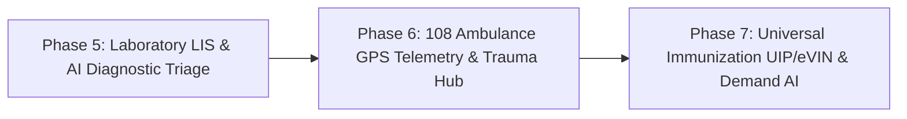

# Arogya Mitra — Complete System Chronology, Architectural Specification & Implementation Record

---

## 1. Project Overview & Problem Statement

**Arogya Mitra** is a comprehensive, production-ready Hospital Management, Clinical Decision Support, and Public Health Platform tailored for rural and underserved healthcare ecosystems in India.

### Problem Addressed
- **Rural Healthcare Bottlenecks**: Fragmentation between village-level health workers (ASHA/ANM), Ayushman Arogya Mandir (AAM) Sub-Centres, Primary Health Centres (PHC), Community Health Centres (CHC), and District Hospitals (DH).
- **Referral Leakage & Maternal Mortality**: Lack of closed-loop tracking for critical maternal emergencies and chronic NCD complications.
- **Intermittent Connectivity**: Rural clinics and field workers operating in zero-network environments without offline synchronization capabilities.
- **National Standards Compliance**: Need for seamless integration with the Ayushman Bharat Digital Mission (ABDM), Jan Aushadhi generic pharmacy systems, and the Integrated Disease Surveillance Programme (IDSP).

---

## 2. Platform Architecture & Multi-Tier Topology

```mermaid
graph TD
    subgraph Frontline Tier [Frontline & Community Tier]
        A1[ASHA Worker App: Voice Symptom Intake]
        A2[ANM Field Worker: High-Risk ANC & NCD Screening]
        A3[Citizen Mobile Pass: ABHA QR Identity & PHR]
    end

    subgraph Facility Tier [Ayushman Arogya Mandir & Sub-Centres]
        B1[CHO Clinic Portal: OPD Tokens & Vitals HUD]
        B2[Offline-First Mutation Queue: Local Storage]
        B3[WebRTC Low-Bandwidth Video Link]
    end

    subgraph Secondary Tier [PHC / CHC / District Hospital Hub]
        C1[Specialist Teleconsultation & Digital Prescription Pad]
        C2[Closed-Loop Referral Network & GPS 108 Ambulance Dispatch]
        C3[Pradhan Mantri Jan Aushadhi Central Pharmacy & Dispensing]
        C4[Hospital Ward Bed Occupancy & Security Audit Stream]
    end

    subgraph Intelligence & Standards Tier [AI & National Health Grid]
        D1[AI CDSS: DDI Rules, Allergies & Pregnancy Safety]
        D2[Epidemiological Surveillance: 7-Day Anomaly Detection]
        D3[ABDM Gateway: M1 ABHA, M2 HIP, M3 FHIR R4 Bundle]
    end

    Frontline Tier --> Facility Tier
    Facility Tier --> Secondary Tier
    Secondary Tier --> Intelligence & Standards Tier
```

---

## 3. Complete Phase-by-Phase Implementation Summary

### 🏗️ Phase 1: Foundation Architecture & Core Infrastructure (Completed)
- **Backend Architecture**:
  - Asynchronous SQLite DB Engine with async SQLAlchemy session pooling (`app/core/database/`).
  - JWT Bearer Authentication and bcrypt password hashing with 8 distinct Healthcare Roles:
    `SUPERADMIN`, `DOCTOR`, `CHO`, `ANM`, `ASHA`, `LAB_TECH`, `PHARMACIST`, `CITIZEN`.
  - Multi-tenant 4-tier facility hierarchy model (`DISTRICT_HOSPITAL`, `CHC`, `PHC`, `SUB_CENTRE`).
  - Immutable 256-bit security audit logging (`app/modules/audit/`).
  - Patient demographic registry (`app/modules/patients/`).
  - Dev seed script with realistic Indian healthcare facilities, staff users, and patient records (`seed_data.py`).
- **Frontend Architecture**:
  - React 18 + Vite + TypeScript with custom Vanilla CSS design tokens.
  - Centralized API client with automatic token attachment (`src/lib/api.ts`).
  - Dynamic bilingual switching between English (`en`) and Hindi (`hi`) (`src/lib/i18n.ts`).
  - 1-Tap Emergency SOS (108) modal with automatic 5-second ambulance dispatch trigger.
  - Role-aware dashboard and patient directory views.
- **Verification**: 6/6 Pytest test suites passed; Vite production build generated with 0 errors.

---

### 🩺 Phase 2: Clinical Core, Referrals & Teleconsultation (Completed)
- **Backend Modules**:
  - `app/modules/referrals/`: Closed-Loop Referral Engine supporting bidirectional referrals (Sub-Centre $\leftrightarrow$ PHC $\leftrightarrow$ CHC $\leftrightarrow$ District Hospital) with 6-stage lifecycle stepper (`INITIATED` $\rightarrow$ `ACCEPTED` $\rightarrow$ `IN_TRANSIT` $\rightarrow$ `RECEIVED` $\rightarrow$ `COUNTER_REFERRED` $\rightarrow$ `CLOSED`).
  - `app/modules/programs/`: Pradhan Mantri Surakshit Matritva Abhiyan (PMSMA) High-Risk Maternal ANC pregnancy tracker & NP-NCD Chronic Disease registry.
  - `app/modules/teleconsult/`: Low-bandwidth WebRTC video teleconsultation session manager with dynamic room tokens.
  - `app/modules/clinical/`: Electronic Medical Records (EMR) with chief complaints, clinical notes, and digital prescriptions tagged with SNOMED-CT and ICD-10 codings.
- **Frontend Applications**:
  - `src/pages/ReferralsPage.tsx`: Interactive referral tracking wizard with filter tabs, GPS ambulance tracking simulation, and counter-referral loop closure.
  - `src/pages/MaternalNcdPage.tsx`: Maternal ANC cohort tracker with high-risk pregnancy badges and NCD screening registry.
  - `src/pages/TeleconsultPage.tsx`: WebRTC video room with local/remote video feeds, 2G bandwidth compression toggle, real-time patient vitals HUD, and in-call digital prescription pad.
  - `src/pages/AppointmentsPage.tsx`: Live OPD queue token ticket with printable ABDM QR code boarding passes.
- **Verification**: 7/7 Pytest test suites passed; Vite production bundle compiled cleanly.

---

### 📦 Phase 3: Frontline Offline Sync, Central Pharmacy & ABDM Gateway (Completed)
- **Backend Modules**:
  - `app/modules/inventory/`: Pradhan Mantri Jan Aushadhi generic formulary catalog, batch tracking with automated expiry calculations ($\le 90\text{ days}$) and low-stock alerts ($\le 50\text{ units}$), stock transaction logs, and 1-tap counter dispensing.
  - `app/modules/sync/`: Frontline offline sync engine with `/api/v1/sync/push` idempotent batch replay and `/api/v1/sync/pull` delta master download.
  - `app/modules/abdm/`: Official ABDM Milestones:
    - **Milestone 1**: 14-digit ABHA Number and `@abdm` address generator.
    - **Milestone 2**: Health Information Provider (HIP) care-context linking.
    - **Milestone 3**: Health Information User (HIU) consent artifact validation and standardized **FHIR R4 JSON Bundle** exchange.
  - `app/modules/admin/`: Hospital bed ward capacity management (Total, Occupied, Available, Oxygen beds, ICU Ventilators) and security audit log stream.
- **Frontend Applications**:
  - `src/lib/offlineSync.ts`: Client-side offline mutation queue with `online`/`offline` browser listeners and automatic background replay.
  - `src/pages/PharmacyPage.tsx`: Inventory dashboard, batch table, PO delivery receiving modal, and pharmacist dispensing counter.
  - `src/pages/AdminPage.tsx`: Ward bed occupancy progress meters, ABDM M1–M3 interactive simulator with JSON viewer, and live security audit trail.
  - `src/components/layouts/AppShell.tsx`: Live offline/online sync pill badge with manual synchronization trigger.
- **Verification**: 11/11 Pytest test suites passed; Vite production bundle compiled cleanly.

---

### 🧠 Phase 4: AI CDSS, Epidemiological Outbreak GIS, Citizen Health Card & Voice Intake (Completed)
- **Backend Modules**:
  - `app/modules/cdss/`: Rule-based AI Clinical Decision Support System:
    - **Drug-Drug Interactions (DDI)**: Detects combinations like Telmisartan + Spironolactone (hyperkalemia), Aspirin + Warfarin (bleeding), Ciprofloxacin + Ondansetron (QTc prolongation).
    - **Cross-Reactive Allergy Class Mapping**: `ALLERGY_CLASS_MAP` mapping beta-lactams and antibiotic families (Penicillin $\rightarrow$ Amoxicillin/Augmentin).
    - **Pregnancy Teratogenicity**: Strict contraindication warnings against ACE inhibitors/ARBs, Tetracyclines, and Fluoroquinolones.
    - **Vitals Red-Flag Triage**: Evaluates critical thresholds (BP $\ge 180/110\text{ mmHg}$, $\text{SpO}_2 < 90\%$) and recommends 1-Tap 108 Emergency Ambulance trigger.
    - **ICD-10 Differential Diagnoses & Evidence-Based Lifestyle Regimens**.
  - `app/modules/analytics/`: Public Health & Epidemiological Surveillance:
    - **7-Day Statistical Anomaly Spike Algorithm ($\mu + 2\sigma$)**: Detects disease surges (Dengue in Bassi $+160\%$, Acute Gastroenteritis in Jamwa Ramgarh).
    - **Geo-Cluster Hotspot Generation**: Block-level coordinates, case counts, and alert levels.
    - **30-Day Disease Morbidity Time-Series**.
- **Frontend Applications**:
  - `src/components/cdss/CdssAlertsBadge.tsx`: Clinical intelligence assistant HUD with severity-coded warning cards, DDI matrix, and lifestyle suggestions.
  - `src/components/voice/VoiceIntakeModal.tsx`: ASHA frontline bilingual voice intake modal using Web Speech API (Hindi `hi-IN` & English `en-IN`) with real-time NLP symptom extraction and 1-tap quick complaint chips.
  - `src/pages/AnalyticsPage.tsx`: Epidemiological Outbreak Surveillance dashboard with 7-day anomaly alert banners, interactive GIS radar hotspot map, disease trend multi-bar charts, and IDSP report export.
  - `src/pages/HealthCardPage.tsx`: Citizen Ayushman Bharat ABHA Digital Health Pass (PVC layout, Government emblem 🇮🇳, QR code pass, verification modal, print view, and longitudinal PHR timeline).
  - Integrated `CdssAlertsBadge` and `VoiceIntakeModal` into `TeleconsultPage.tsx` and updated global navigation.
- **Verification**: **13/13 Pytest test suites passed**; Vite production bundle compiled cleanly in 6.1s (**0 TypeScript errors**).

---

## 4. Test Verification Suite Status

```
============================= test session starts =============================
platform win32 -- Python 3.14.7, pytest-9.1.1, pluggy-1.6.0
rootdir: E:\SIH\SIH Demo with Audit and research\arogya mitra\backend
configfile: pyproject.toml
plugins: anyio-4.15.1, asyncio-1.4.0

tests/test_api.py::test_health_check PASSED                              [  7%]
tests/test_api.py::test_auth_login_and_me PASSED                         [ 15%]
tests/test_api.py::test_branches_and_patients PASSED                     [ 23%]
tests/test_api.py::test_referrals_workflow PASSED                        [ 30%]
tests/test_api.py::test_programs_maternal_and_ncd PASSED                 [ 38%]
tests/test_api.py::test_teleconsult_session PASSED                       [ 46%]
tests/test_api.py::test_clinical_consultations_and_ehr PASSED            [ 53%]
tests/test_api.py::test_inventory_and_dispensing PASSED                  [ 61%]
tests/test_api.py::test_offline_sync PASSED                              [ 69%]
tests/test_api.py::test_abdm_m1_m2_m3_simulator PASSED                   [ 76%]
tests/test_api.py::test_admin_wards_and_audit PASSED                     [ 84%]
tests/test_api.py::test_cdss_evaluations PASSED                          [ 92%]
tests/test_api.py::test_public_health_analytics PASSED                   [100%]

======================= 13 passed, 7 warnings in 8.76s ========================
```

---

## 5. Roadmap for Advanced Extensions (Phases 5, 6, & 7)



### 🧪 Phase 5: Laboratory Information System (LIS) & AI Diagnostic Triage
- **Lab Order & Specimen Workflow**: Complete Blood Count (CBC), LFT, KFT, Lipid Profile, HbA1c, Dengue NS1/IgM, Sputum AFB for TB, and Malaria.
- **Specimen Barcode Tracking**: Sample collection $\rightarrow$ Vacutainer barcoding $\rightarrow$ Analyzer processing $\rightarrow$ Doctor verification.
- **Critical Lab Value Alerts**: Automated flags for dangerous lab levels (Platelets $< 50,000/\mu\text{L}$, Potassium $> 6.0\text{ mEq/L}$, Hemoglobin $< 7.0\text{ g/dL}$).
- **Interactive Report Viewer**: Digital diagnostic report viewer linked to the citizen's ABHA record.

### 🚑 Phase 6: 108 Emergency Fleet Dispatch, Pre-Hospital Tele-Triage & Trauma Bay Hub
- **108 Ambulance GPS Telemetry**: Real-time fleet tracking of 108 ALS and BLS vehicles with speed, oxygen levels, and ETA calculation.
- **En-Route Pre-Hospital Tele-Triage**: Live transmission of paramedic vitals (ECG rhythm, BP, $\text{SpO}_2$, GCS coma scale) directly to the receiving District Hospital while en route.
- **Hospital Trauma Bay Preparation Mode**: 1-Click trigger preparing Trauma Team, OT readiness, blood bank cross-matching, and emergency resuscitation bays before arrival.

### 💉 Phase 7: Universal Immunization Programme (UIP/eVIN) & AI Demand Forecasting
- **National UIP Child & Maternal Vaccination Schedule**: Full Government of India immunization grid from Birth to 16 years (BCG, OPV, Hep B, Pentavalent, Rotavirus, PCV, MR, DPT, Td) with due-date tracking and ASHA drop-out alerts.
- **eVIN IoT Vaccine Cold Chain**: Real-time $+2^\circ\text{C}$ to $+8^\circ\text{C}$ refrigerator temperature monitoring with excursion alarms.
- **AI Predictive Supply Demand Forecasting**: Surge prediction for antimalarials, ORS, IV fluids, and anti-snake venom based on seasonal epidemiological patterns.

---

## 6. Local Setup & Execution Guide

### Backend Server Execution
```bash
cd "arogya mitra/backend"
py -m uvicorn app.main:app --host 127.0.0.1 --port 8000 --reload
```

### Frontend Client Execution
```bash
cd "arogya mitra/frontend"
npm run dev
```

### Pre-Configured Demo Credentials
| Role | Username | Password | Operational Scoping |
|---|---|---|---|
| **System Administrator** | `admin` | `password123` | Hospital Superintendent, Wards, ABDM M1–M3, Audit Logs |
| **Medical Specialist / Doctor** | `dr_sharma` | `password123` | Teleconsultations, Prescriptions, AI CDSS audits, Referral queues |
| **Community Health Officer (CHO)** | `cho_meena` | `password123` | Sub-Centre OPD, High-Risk ANC enrollments, NCD screenings |
| **ASHA Frontline Worker** | `asha_rekha` | `password123` | Voice intake symptom capture, Village door-to-door triage |
| **Pharmacist** | `pharm_kumar` | `password123` | Jan Aushadhi counter dispensing, Batch expiry inventory |
| **Citizen / Patient** | `citizen_rajesh` | `password123` | Ayushman Bharat ABHA Health Card, PHR Timeline |
