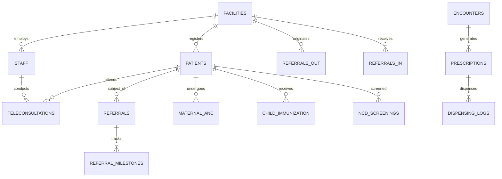

# Technical Requirements Document (TRD)

## Arogya Mitra — Technical Architecture & Implementation Specification

---

## 1. Recommended Production Tech Stack

| Layer | Selected Technology | Version | Rationale & Selection Criteria |
|---|---|---|---|
| **Backend API Engine** | **FastAPI (Python)** | `3.12+ / 0.115+` | Native asynchronous I/O, ultra-fast Pydantic v2 validation, automatic OpenAPI / Swagger generation, rich AI/ML ecosystem. |
| **ORM & Data Access** | **SQLAlchemy (Async)** | `2.0+` | Async engine, PostgreSQL native JSONB and UUID support, explicit query control, transaction isolation. |
| **Database Migration** | **Alembic** | `1.13+` | Version-controlled, reversible, scriptable schema migrations integrated directly with SQLAlchemy models. |
| **Relational Database** | **PostgreSQL** | `16+` | Enterprise multi-schema support, native JSONB with GIN indexing for clinical EMR, Row-Level Security (RLS), declarative partitioning. |
| **Connection Pooling** | **PgBouncer** | `1.22+` | Transaction-level connection pooling to handle 10,000+ concurrent connections without DB memory exhaustion. |
| **Distributed Cache & Queue** | **Redis** | `7.2+` | Sub-millisecond session store, distributed locks (Redlock) for bed/slot allocations, atomic token queue sequences. |
| **Internal Event Bus** | **Redis Streams** | `7.2+` | Decoupled cross-module asynchronous messaging using the Transactional Outbox Pattern. |
| **Task Queue** | **Celery** | `5.4+` | Background asynchronous task execution for ABDM FHIR syncing, SMS/WhatsApp alerts, and nightly statutory reconciliation. |
| **Real-Time Communication** | **Socket.io / Engine.IO** | `v4 / python-socketio` | Bi-directional streaming for live queue display boards, vital alarm monitoring, and ward bed status updates. |
| **Frontend Framework** | **React + TypeScript** | `18.3+ / 5.5+` | Component-based, strict type safety, predictable state management, rich clinical UI ecosystem. |
| **Internationalization (i18n)** | **react-i18next** | `14+` | Seamless runtime switching between English (`en`) and Hindi Devanagari (`hi`). |
| **Build Tool & Bundler** | **Vite** | `5.4+` | Sub-second Hot Module Replacement (HMR) and optimized Rollup production bundles. |
| **Styling & Design System** | **Tailwind CSS + Custom Tokens** | `3.4+` | Master palette tokens (`#0A1120`, `#FF6A38`, `#06D6A0`, `#2563EB`, `#5438DC`, `#EF4444`) with high-density utility styling. |
| **Client State Management** | **Zustand + TanStack Query** | `v5` | Minimalist client store (Zustand) combined with declarative server-state caching and auto-invalidation (TanStack Query). |
| **Object Storage (S3)** | **MinIO (Self-Hosted) / AWS S3** | `RELEASE.2024+` | S3-compatible, WORM (Write Once Read Many) compliant encrypted storage for DICOM, PDF reports, and scanned records. |
| **DICOM PACS Server** | **Orthanc PACS** | `1.12+` | Standard-compliant lightweight DICOM/VNA server supporting WADO-RS for browser-based medical imaging. |
| **Telemedicine Engine** | **Jitsi Meet / WebRTC (Self-Hosted)** | `Latest` | WebRTC end-to-end encrypted video streaming with adaptive bitrate streaming for rural 3G/4G network resilience. |
| **Code Quality & Linter** | **Ruff + Mypy (Strict)** | `Latest` | 100x faster Python linting/formatting and strict static typing. |

---

## 2. System Architecture & Component Topology

```
┌────────────────────────────────────────────────────────────────────────────────────────────────────────┐
│                              React + TypeScript Frontend Application                                   │
│  [ Clinician Workstation ]  [ Frontline ASHA/ANM/CHO App ]  [ Live TV Queue ]  [ Citizen Mobile/PWA ]  │
└───────────────────────────────────────────────────┬────────────────────────────────────────────────────┘
                                                    │ HTTPS / WSS
                                                    ▼
┌────────────────────────────────────────────────────────────────────────────────────────────────────────┐
│                                FastAPI Gateway & Cross-Cutting Core                                    │
│   [ Auth / JWT / ABAC ]   [ BranchScope Middleware (RLS) ]   [ Rate Limiter ]   [ Audit Interceptor ]   │
└───────────────────────────────────────────────────┬────────────────────────────────────────────────────┘
                                                    │
        ┌───────────────────────────────────────────┼───────────────────────────────────────────┐
        ▼                                           ▼                                           ▼
┌───────────────────────┐               ┌───────────────────────┐               ┌───────────────────────┐
│  modules/patients     │               │  modules/clinical     │               │  modules/referrals    │
│  - EMPI & Demographics│               │  - Encounters & Vitals│               │  - Closed-Loop Engine │
│  - ABHA M1 Integration│               │  - Dynamic Templates  │               │  - 108 Emergency Push │
│  - High-Risk Cohorts  │               │  - Assisted Telehealth│               │  - Reverse Feedback   │
└───────────┬───────────┘               └───────────┬───────────┘               └───────────┬───────────┘
            │                                       │                                       │
            └───────────────────────────────────────┼───────────────────────────────────────┘
                                                    │
                                                    ▼
┌────────────────────────────────────────────────────────────────────────────────────────────────────────┐
│                              Internal Event Bus (Redis Streams + Outbox)                               │
│  [ Event: "referral.created" ]   [ Event: "teleconsult.started" ]   [ Event: "high_risk.flagged" ]     │
└──────────────────────────┬────────────────────────────────────────────────────────┬────────────────────┘
                           │                                                        │
                           ▼                                                        ▼
┌─────────────────────────────────────────────────────┐  ┌───────────────────────────────────────────────┐
│               Celery Background Workers             │  │            Socket.io Cluster Server           │
│   - ABDM FHIR Bundle Generation & HIP Push          │  │   - Live OPD Queue Board Streaming            │
│   - SMS / WhatsApp Dispatch (Bilingual)             │  │   - Tele-Hub Video Room State Sync            │
│   - 108 Ambulance Dispatch Webhook                  │  │   - Real-time Referral Acceptance Alerts      │
└─────────────────────────────────────────────────────┘  └───────────────────────────────────────────────┘
```

---

## 3. Database Architecture & Multi-Schema Design

A single PostgreSQL 16 instance partitioned into **10 dedicated schemas**:

```sql
-- PostgreSQL 16 Multi-Schema Setup
CREATE SCHEMA core;          -- Master patients, staff (Doctor, Nurse, CHO, ANM, ASHA), branches/facilities
CREATE SCHEMA clinical;      -- Encounters, observations (JSONB), vitals, digital prescriptions, teleconsultations
CREATE SCHEMA scheduling;    -- Doctor rosters, appointment slots, live token queue state
CREATE SCHEMA referrals;     -- Closed-loop referral tokens, emergency escalations, reverse feedback logs
CREATE SCHEMA cohorts;       -- Maternal ANC/PNC records, child immunization schedules, NCD 30+ screenings
CREATE SCHEMA ipd;           -- Ward master, rooms, bed occupancy matrix, e-MAR, nursing notes
CREATE SCHEMA ot;            -- Operation theatre slots, WHO surgical checklists, anesthesia logs
CREATE SCHEMA lab;           -- Test directories, sample accessioning, lab results, district routing
CREATE SCHEMA pharmacy;      -- Drug master, batch inventory, FEFO allocations, dispensing
CREATE SCHEMA billing;       -- Charge masters, bills, payments, GST e-invoices, PM-JAY / NHCX claims
CREATE SCHEMA abdm;          -- ABHA profiles, consent manager artifacts, HIP/HIU data bridge
CREATE SCHEMA audit;         -- Partitioned immutable audit log records (Monthly partitions)
```

### 3.1 Entity Relationship Diagram (Public Health Extensions)



---

## 4. Authentication, Authorization & Frontline Roles

### 4.1 Role-Based Access Control (RBAC) Matrix
Added dedicated frontline worker roles alongside hospital staff:

| Role Code | Role Name | Permitted Actions / Scope |
|---|---|---|
| `ROLE_SUPERADMIN` | System Group Admin | Multi-branch facility configuration, global analytics, audit explorer. |
| `ROLE_DOCTOR` | Medical Officer / Specialist | OPD/IPD consultations, tele-hub consultations, OT surgery, Rx authorization. |
| `ROLE_CHO` | Community Health Officer | Sub-Centre screening, initiating assisted teleconsults, local drug dispensing. |
| `ROLE_ANM` | Auxiliary Nurse Midwife | Field ANC/PNC checkups, child immunization entry, village NCD surveys. |
| `ROLE_ASHA` | ASHA Worker | Village demographic census, high-risk patient follow-up reminders. |
| `ROLE_NURSE` | Staff Nurse | Ward bed allocation, e-MAR medication administration, vitals recording. |
| `ROLE_PHARMACIST` | Pharmacist | Batch stock entry, automated FEFO dispensing, district stock checks. |
| `ROLE_BILLING` | Billing Executive | Bill generation, GST IRN creation, PM-JAY cashless claims. |

---

## 5. Assisted Teleconsultation & Referral Protocols

### 5.1 Assisted Teleconsultation WebRTC Flow
1. **CHO Launch**: CHO clicks "Start Assisted Video Consult" on Sub-Centre tablet $\to$ FastAPI generates a secure ephemeral room token via Jitsi/WebRTC.
2. **Specialist Connection**: District Hospital Tele-Hub Specialist receives an audible incoming call alert on their dashboard.
3. **Telemetry Streaming**: Real-time patient vitals (BP, SpO2, Pulse) are streamed alongside the WebRTC video channel using Socket.io.
4. **Rx Finalization**: Specialist signs the digital prescription $\to$ Redis Streams dispatches `event: "teleconsult.rx_issued"` $\to$ CHO's tablet immediately displays the prescription to dispense local Sub-Centre medicines.

### 5.2 Closed-Loop Referral Protocol
1. **Creation**: MO / CHO submits referral with reason, severity (*Normal / Urgent / Emergency 108*), and attached lab reports.
2. **Bed & Doctor Hold**: System reserves an emergency consultation slot / bed at the target District Hospital.
3. **Emergency Webhook**: If marked `Emergency 108`, an instant webhook payload is dispatched to the state 108 Emergency Ambulance API with GPS coordinates.
4. **Loop Closure**: When the patient is discharged from the DH, the attending specialist submits a **Reverse Discharge Summary**, which triggers a notification on the referring CHO's dashboard for community follow-up.

---

## 6. Internationalization (i18n) & Bilingual Architecture

- **Engine**: `react-i18next` with modular JSON translation dictionaries (`locales/en/translation.json`, `locales/hi/translation.json`).
- **Font Rendering**: Google Font `'Noto Sans Devanagari'` preloaded to guarantee zero font-layout shifts (CLS) when toggling between English and Hindi.
- **Audio Announcements**: Text-to-Speech (Web Speech API) supporting Hindi voice synthesis for public queue token callouts (`"टोकन नंबर १०८, कमरा नंबर ४ में पधारें"`).

---

## 7. Storage, Security & Compliance

- **MinIO S3 Encrypted Storage**:
  - Buckets: `arogya-prescriptions`, `arogya-lab-reports`, `arogya-referral-docs`, `arogya-teleconsult-recordings`.
  - Retention: WORM policy (7-year medical retention compliance).
- **DPDP Act 2023 & Encryption**:
  - PII columns (`phone_primary`, `aadhaar_hash`, `abha_id`) encrypted at rest using **AES-256-GCM**.
  - Granular patient consent ledger (`abdm.consent_artifacts`) with immutable revocation tracking.
