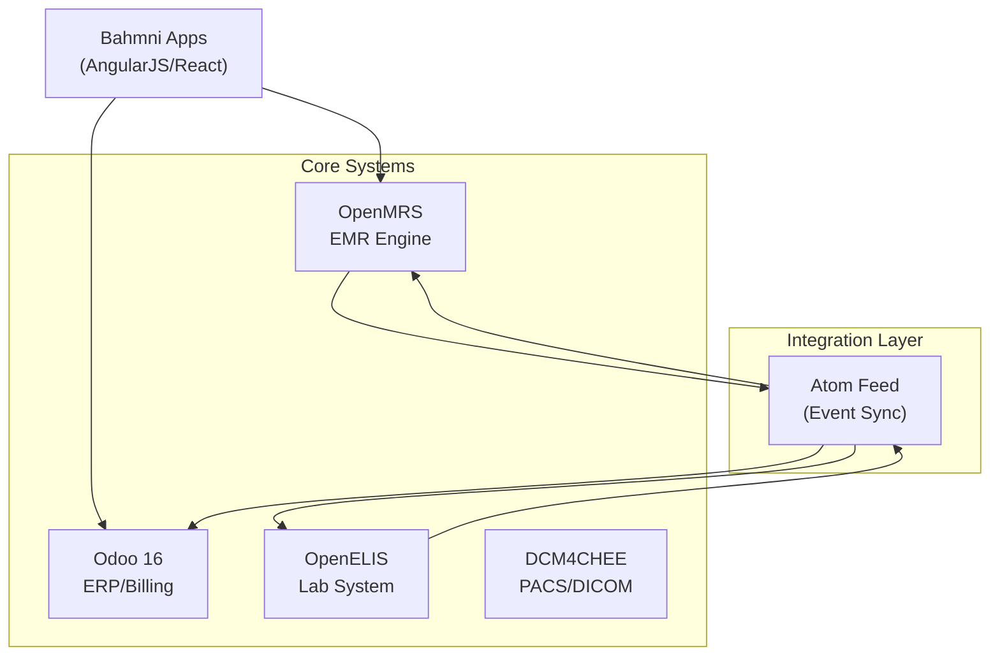

# Bahmni — Deep Architecture Analysis

> Source: [github.com/Bahmni](https://github.com/Bahmni) | 200K+ LOC | Java + AngularJS/React | 10+ years | 500+ hospitals in 50+ countries

---

## 1. What Bahmni Actually Is

Bahmni is an **integration layer** — it is NOT a single monolithic application. It orchestrates **four independent open-source systems** into a unified hospital workflow:

| Component | Technology | Role |
|---|---|---|
| **OpenMRS** | Java/Spring | EMR — clinical records, patient registration, diagnoses, orders |
| **Odoo** (formerly OpenERP) | Python | ERP — billing, pharmacy inventory, accounting, financial reports |
| **OpenELIS** | Java | LIS — lab test ordering, sample tracking, result reporting |
| **DCM4CHEE** | Java | PACS — DICOM image storage, radiology viewer |

The Bahmni "glue" consists of:
- `bahmni-core` — OpenMRS module adding Bahmni-specific REST APIs
- `bahmni-apps` — AngularJS/React frontend (the unified UI)
- `openmrs-atomfeed-omod` — Event feed for cross-system sync
- `bahmni-reports` — Jasper-based reporting engine
- Docker Compose orchestration (`bahmni-docker`)

---

## 2. Architecture — The Multi-System Integration Model

### 2.1 Atom Feed Integration Pattern (Critical to Understand)

This is Bahmni's **most important architectural pattern** — and also its **biggest limitation**.

**How it works:**
1. When a patient is registered in OpenMRS → an event is written to `event_records` table
2. Odoo/OpenELIS poll this Atom Feed (HTTP endpoint) on a schedule
3. On receiving a new event, the consumer calls back to OpenMRS REST API to get the full data
4. If processing fails, the event goes to a `failed_events` table for retry

**The good:**
- **Loosely coupled** — systems don't directly import each other's code
- **Eventually consistent** — a temporary outage in Odoo doesn't break EMR
- **Failure tracking** — failed events are logged and retried

**The bad:**
- **Polling-based** — latency between systems (not real-time)
- **No schema contract** — the feed is just event URLs; the consumer must know the source's REST API structure
- **Debugging nightmare** — when sync breaks, tracing which event failed across 3 systems is extremely painful
- **No transactional guarantees** — a drug order placed in OpenMRS might not appear in Odoo pharmacy for minutes

**Key insight for Arogya Mitra:** We solve this by being a **single codebase with an internal event bus** (§10 of blueprint). Cross-module events are in-process Redis Streams — no HTTP polling, no separate databases, no sync lag. This is the single biggest architectural advantage we have over Bahmni.

---

## 3. Module-by-Module Assessment

### 3.1 Clinical Records (OpenMRS core)
- **Quality: ★★★★★** — 20 years of refinement, concept dictionary is brilliant
- **Limitation:** EAV `obs` table becomes slow at scale; complex queries need denormalization
- **Our approach:** JSONB-based specialty templates (same flexibility, better performance)

### 3.2 Pharmacy & Billing (Odoo)
- **Quality: ★★★☆☆** — Odoo is an ERP, not a healthcare billing system
- **Limitation:** 
  - No Indian GST e-invoicing/IRN out of the box
  - No NHCX/PM-JAY claim integration
  - No idempotent payment handling
  - Pharmacy FEFO is basic; no AI-forecasted reorder
- **Our approach:** Purpose-built `modules/billing` and `modules/pharmacy` with India-specific compliance baked in

### 3.3 Laboratory (OpenELIS)
- **Quality: ★★★☆☆** — Adequate for basic lab workflows
- **Limitation:**
  - Separate database, separate auth system
  - Sync lag via Atom Feed
  - No real-time result push to EMR
- **Our approach:** Single `modules/lab` within the monolith — same database, same auth, instant result availability

### 3.4 Radiology (DCM4CHEE)
- **Quality: ★★★★☆** — DCM4CHEE is a solid PACS server
- **Our approach:** Keep Orthanc (open-source PACS) as an external service, but integrate via our `modules/radiology` for ordering/reporting

### 3.5 OT Scheduling
- **Quality: ★★★☆☆** — Bahmni has a basic OT module
- **Limitation:**
  - No WHO Surgical Safety Checklist enforcement
  - No implant tracking
  - No anaesthesia records
  - No Aldrete post-op scoring
- **Our approach:** Full-featured `modules/ot` with all perioperative documentation

### 3.6 Appointment Scheduling
- **Quality: ★★☆☆☆** — Basic slot management
- **Limitation:**
  - No video consultation support
  - No multi-branch booking
  - No real-time queue board
  - No walk-in handling
- **Our approach:** Dual-mode (in-person + video) engine with live queue via Socket.io

---

## 4. Code Quality Assessment

### Strengths
- **Battle-tested in real hospitals** — 500+ deployments, including India (JSS Bilaspur, Nagaland districts)
- **Docker-first deployment** — `bahmni-docker` makes spinning up the full stack straightforward
- **Configuration over code** — Many workflows customizable via JSON/XML without code changes
- **SNOMED CT integration** — Standardized clinical terminology
- **Community-driven** — Active development, regular releases

### Weaknesses
- **AngularJS legacy** — Large portions of `bahmni-apps` still use AngularJS 1.x (end-of-life since 2021)
- **No TypeScript** — Frontend is untyped JavaScript in many places
- **Integration complexity** — Running 4 separate systems (OpenMRS + Odoo + OpenELIS + DCM4CHEE) requires significant ops expertise
- **No multi-tenancy** — Each hospital needs its own full stack deployment
- **No branch-scoping** — Not designed for multi-branch hospital groups
- **No ABDM integration** — FHIR R4 / ABHA / HIP/HIU must be added separately
- **No NHCX / PM-JAY** — Insurance claims are not supported
- **No statutory payroll** — PF/ESI/TDS not in scope
- **Memory-hungry** — Running 4 JVMs + Odoo + PostgreSQL + MySQL requires substantial RAM
- **No real-time features** — No WebSocket/Socket.io for live dashboards

### What They Got Right (adopt)
1. **Configurable forms** — JSON-driven clinical form definitions
2. **Offline-first mindset** — Built for unreliable networks (India context)
3. **Docker Compose orchestration** — One command to spin up everything
4. **Feed-based integration** — Event-driven (even if the implementation is polling-based)
5. **Separation of concerns** — Each system owns its domain completely

### What They Got Wrong (avoid)
1. **Multi-system complexity** — 4 databases, 4 auth systems, 4 deployment targets
2. **Polling-based sync** — Should be push-based or shared-database
3. **AngularJS** — Should have migrated earlier; now carrying legacy debt
4. **No branch awareness** — Single-site assumption baked deep into the data model
5. **No financial compliance** — GST, e-invoicing, statutory payroll are afterthoughts

---

## 5. Key Repositories & What to Study

| Repo | What to study | Why |
|---|---|---|
| [bahmni-core](https://github.com/Bahmni/bahmni-core) | REST API design, OpenMRS module structure | See how they extend OpenMRS for hospital workflows |
| [openmrs-module-bahmniapps](https://github.com/Bahmni/openmrs-module-bahmniapps) | Frontend component architecture | Learn what clinical UI components are needed |
| [bahmni-docker](https://github.com/Bahmni/bahmni-docker) | Docker Compose multi-service setup | Reference for our own Docker Compose |
| [openmrs-module-appointments](https://github.com/Bahmni/openmrs-module-appointments) | Appointment scheduling model | Baseline to improve upon |
| [bahmni-reports](https://github.com/Bahmni/bahmni-reports) | Report generation patterns | Jasper-based; we'll use Python alternatives |

---

## 6. Production Deployment Insights (India)

- **JSS Hospital, Bilaspur** — Charitable hospital, one of the first Bahmni deployments in India
- **Nagaland district hospitals** — State-supported rollout
- **500+ hospitals across 50+ countries** — Proven at scale in low-resource settings

**Common production issues reported:**
1. Java heap space exhaustion (multiple JVMs)
2. Atom Feed sync failures causing data inconsistency
3. Odoo upgrade path breaking billing customizations
4. Complex backup/restore due to multi-database architecture
5. Training burden — staff must learn different UIs for different subsystems

**Our advantage:** Single codebase, single database, single UI = dramatically simpler operations.
