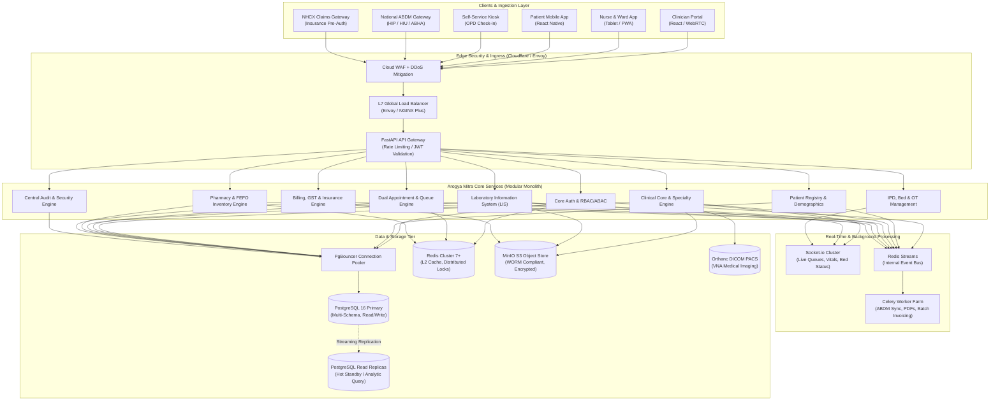
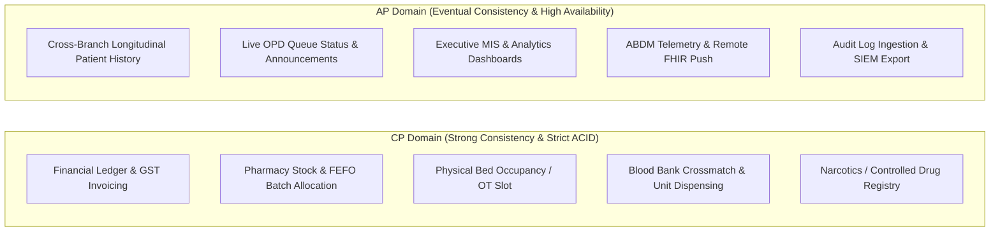
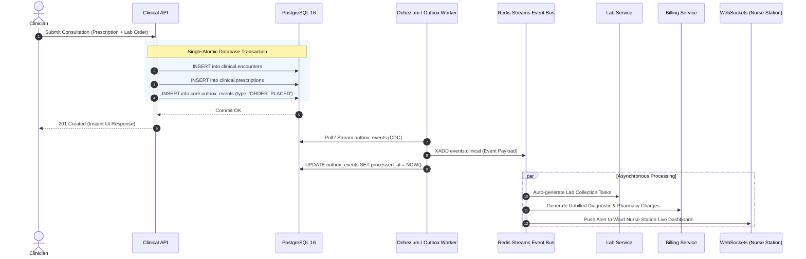
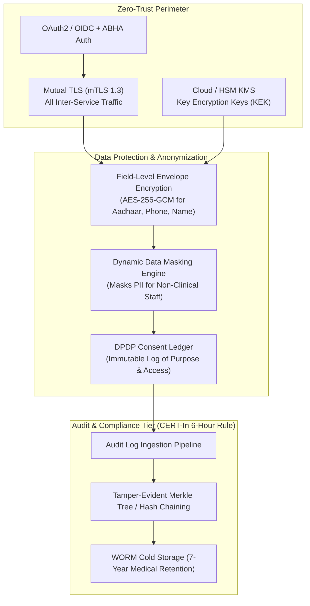
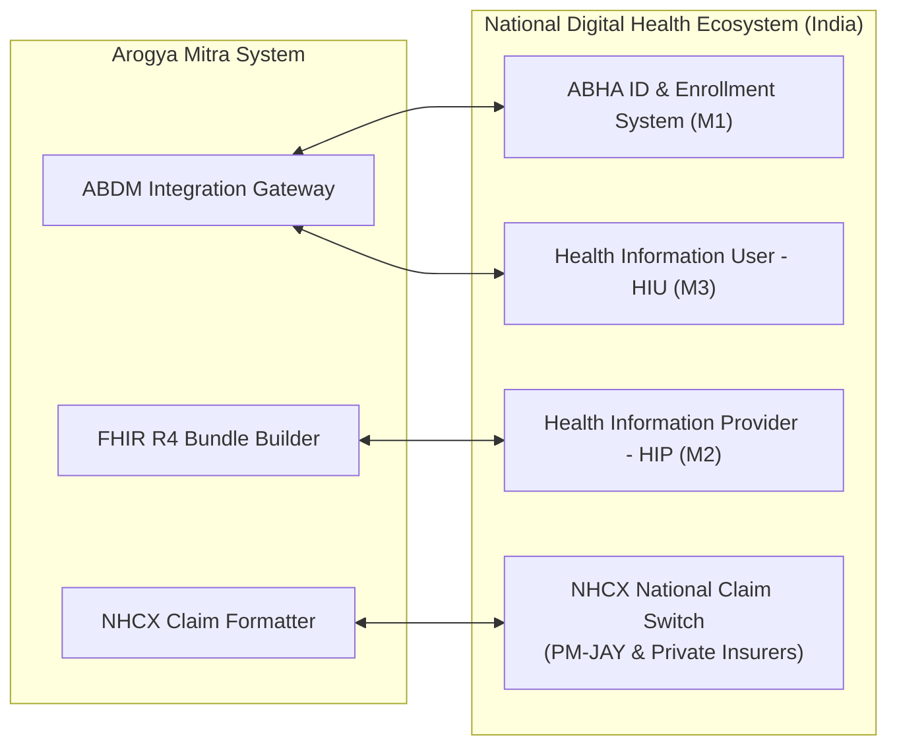

# Enterprise Hospital Management System (HMS) — High-Level System Design

> **Architecture Standard**: Tier-4 Mission-Critical Healthcare Platform  
> **Scale Target**: 50+ Multi-Specialty Hospital Branches | 100,000+ Daily Encounters | 99.999% Availability (Five Nines)  
> **Compliance Benchmark**: ABDM (India), NABH 6th Edition, DPDP Act 2023, CERT-In, HL7 FHIR R4, DICOM PS3.0, ISO 27799 / 27001

---

## 1. System Scale, Throughput & Capacity Planning

To design an enterprise-grade HMS, we first establish the physical scale, IOPS, and network bandwidth requirements for a multi-branch hospital network in India.

### 1.1 Baseline Scale Assumptions (50 Multi-Specialty Branches)
- **Bed Capacity**: 10,000 total beds across 50 branches (average 200 beds/branch).
- **Daily Footfall**:
  - **OPD Consultations**: 50,000 visits/day.
  - **Emergency / Trauma Visits**: 5,000 visits/day.
  - **IPD Admissions / Discharges**: 2,500 patients/day.
  - **Diagnostic Tests (Lab + Radiology)**: 120,000 tests/day.
  - **Pharmacy Dispenses**: 60,000 prescription lines/day.
- **Active Healthcare Workers**: 15,000 concurrent clinicians, nurses, pharmacists, and admins.

### 1.2 Quantitative Throughput (QPS) Calculations
- **Operating Window**: Peak 10-hour hospital load (8:00 AM – 6:00 PM).
- **Peak Load Factor**: 2.5x average load.

$$\text{Daily Transactions} = 50\text{k OPD} + 5\text{k ER} + 2.5\text{k IPD} + 120\text{k Diagnostics} + 60\text{k Pharmacy} \approx 237,500 \text{ core events}$$

- Each event triggers $\approx 15$ database read/write queries (validation, audit, balance checks, notifications, inventory locks).
- **Total Peak Write Operations**:
  $$\text{Avg Writes/sec} = \frac{237,500 \times 15}{10 \times 3600} \approx 99 \text{ writes/sec}$$
  $$\text{Peak Writes/sec} = 99 \times 2.5 \approx 250 \text{ writes/sec}$$
- **Total Peak Read Operations (Dashboard, Charts, Queue, Vitals monitoring)**:
  - 15,000 concurrent staff querying every 10 seconds $\implies \approx 1,500 \text{ read QPS}$.
  - Patient Portal & Telemedicine: $\approx 500 \text{ read QPS}$.
  - **Total Peak Read QPS**: $\approx 2,000 - 3,500 \text{ QPS}$.

### 1.3 Storage & Bandwidth Growth Modeling
- **Relational Data**: $\approx 1.5 \text{ KB}$ per encounter $\times 237,500 \text{ encounters/day} \approx 350 \text{ MB/day} \implies \approx 130 \text{ GB/year}$.
- **Immutable Audit Trail (JSONB Diffs)**: $\approx 2 \text{ GB/day} \implies \approx 730 \text{ GB/year}$.
- **Radiology (DICOM PACS)**:
  - Average X-Ray: $15 \text{ MB}$, CT Scan: $150 \text{ MB}$, MRI: $300 \text{ MB}$.
  - Daily Imaging Volume: $2,500 \text{ studies/day} \times 80 \text{ MB avg} \approx 200 \text{ GB/day} \implies \approx 73 \text{ TB/year}$.
- **Object Storage (Scanned Reports, Prescriptions, PDFs)**: $\approx 10 \text{ GB/day} \implies \approx 3.65 \text{ TB/year}$.

---

## 2. High-Level Topology Architecture

The system operates on an **Edge-to-Cloud Hybrid Mesh** to guarantee hospital survivability during Wide Area Network (WAN) disruptions while maintaining unified enterprise analytics and central billing.



---

## 3. Data Tier & Consistency Boundaries (CAP Theorem in HMS)

In a healthcare ecosystem, applying uniform consistency across all sub-systems leads to catastrophic deadlocks or dangerous race conditions. We define strict **Consistency Domains**.



### 3.1 Strong Consistency (ACID / Pessimistic Locking)
- **Bed Allocation & OT Booking**: Must prevent double-booking. Handled via PostgreSQL row-level locks (`SELECT ... FOR UPDATE`) and Redis distributed locks with Redlock for sub-second reservation holds.
- **Pharmacy FEFO Dispensing**: Stock deduction requires transaction isolation level `REPEATABLE READ` to prevent race conditions during simultaneous dispenses of the same batch.
- **Financial Balances & GST Numbers**: Sequential, gapless invoice number generation via PostgreSQL atomic sequences.

### 3.2 Eventual Consistency (BASE / Event-Driven)
- **Cross-Branch Patient Record Viewing**: When Branch A updates a medical summary, Branch B receives the updated record via Redis Streams $\to$ Celery sync worker within $\le 500 \text{ ms}$.
- **ABDM Health Data Transfer**: When a patient gives consent on their phone via an ABHA app, the FHIR bundle is generated asynchronously by Celery and pushed to the national gateway.

---

## 4. Multi-Tenant / Multi-Branch Isolation Architecture

Arogya Mitra uses a **Single Shared Database with Multi-Schema & Row-Level Security (RLS)** model. This guarantees strict data privacy between branches while allowing authorized cross-branch transfers and unified global analytics.

```
┌────────────────────────────────────────────────────────────────────────┐
│                        PostgreSQL 16 Engine                            │
├────────────────────────────────────────────────────────────────────────┤
│  Schema: core         (Global: patients, staff, master_drugs, icd10)   │
│  Schema: clinical     (Encounter data, observations, prescriptions)   │
│  Schema: scheduling   (Appointments, queues, doctor rosters)          │
│  Schema: billing      (Invoices, payment gateway ledger, claims)       │
│  Schema: ipd          (Admissions, ward layouts, bed occupancy)        │
│  Schema: audit        (Partitioned immutable compliance logs)          │
└────────────────────────────────────────────────────────────────────────┘
```

### 4.1 Row-Level Security (RLS) Policy Example
Every transactional table contains a `branch_id UUID`. PostgreSQL RLS is enforced at the database level:

```sql
-- Enable Row Level Security on appointments
ALTER TABLE scheduling.appointments ENABLE ROW LEVEL SECURITY;

-- Create policy based on application session variable
CREATE POLICY branch_isolation_policy ON scheduling.appointments
    FOR ALL
    USING (
        branch_id = NULLIF(current_setting('app.current_branch_id', true), '')::uuid
        OR
        current_setting('app.is_super_admin', true) = 'true'
    );
```

### 4.2 Middleware Execution Flow
1. User logs in $\to$ JWT is issued containing `user_id`, `role`, `assigned_branch_id`, and `authorized_branches[]`.
2. Request hits FastAPI Gateway $\to$ `BranchScopeMiddleware` intercepts request.
3. Middleware extracts `branch_id` from JWT or `X-Branch-ID` header (validated against `authorized_branches`).
4. On acquiring a DB connection from the async pool, the middleware executes:
   ```sql
   SET LOCAL app.current_branch_id = 'c4b8e21a-9f44-4820-9281-123456789abc';
   ```
5. All subsequent ORM and raw SQL queries are automatically constrained to that branch.

---

## 5. Caching Strategy & Multi-Tier Invalidation

To maintain sub-$50\text{ ms}$ response times under peak 3,500 QPS, we use a three-tier caching hierarchy:

```
[ L1: Application Local In-Memory (Cachetools / LRU) ] -> Cache Hit: < 0.1 ms
                       │ (Miss)
[ L2: Distributed Redis 7+ Cluster (Key-Value & Hashes) ] -> Cache Hit: < 2 ms
                       │ (Miss)
[ L3: PostgreSQL Database via PgBouncer Pool ]          -> Read: 5 - 20 ms
```

| Cache Layer | Data Cached | TTL | Invalidation Strategy |
|---|---|---|---|
| **L1 (In-Memory)** | Master ICD-10 codes, Drug Master Catalog, Branch Metadata | 60 mins | Time-based TTL + Redis Pub/Sub broadcast on master update |
| **L2 (Redis)** | User Session, Active Permissions (RBAC), Doctor Live Roster, Current Token Queue | 5-15 mins | Write-through on booking/cancellation; explicit cache eviction |
| **L2 (Redis)** | Active Bed Status Matrix (Occupied/Vacant/Cleaning) | Realtime | Event-driven: modified on admission, transfer, or housekeeping update |
| **L2 (Redis Locks)** | Appointment Slot Hold (5-minute checkout lock) | 300 sec | Expiring key with auto-release |

---

## 6. Real-Time Streaming & Internal Event Bus (Outbox Pattern)

To prevent distributed data corruption (where DB writes succeed but event publishing fails), the platform enforces the **Transactional Outbox Pattern**.



---

## 7. Security, Zero Trust & Healthcare Privacy Architecture

The platform is designed to comply with India's **Digital Personal Data Protection (DPDP) Act 2023**, **NABH 6th Edition**, and **CERT-In cybersecurity directives**.



### 7.1 Field-Level Envelope Encryption
- Standard database encryption (TDE) protects against physical disk theft but does not protect against SQL injection or privileged DBA snooping.
- High-risk columns (`aadhaar_hash`, `national_id`, `primary_phone`, `hiv_status`, `psychiatric_notes`) are encrypted application-side using **AES-256-GCM** with unique Data Encryption Keys (DEK) wrapped by a Key Encryption Key (KEK) in a hardware security module (HSM).

### 7.2 Dynamic Data Masking
- **Receptionist / Billing Clerk**: Sees `First Name: Rahul`, `Phone: ******9821`, `Aadhaar: ****-****-1234`.
- **Treating Doctor / Primary Nurse**: Sees full patient details.
- **Analyst / Researcher**: Sees de-identified datasets where identifiers are stripped and timestamps are generalized (k-anonymity).

---

## 8. National Healthcare Integrations (ABDM & NHCX Engine)

Arogya Mitra operates as a certified **ABDM Milestone M1, M2, and M3** platform and integrates with the **National Health Claims Exchange (NHCX)**.



### 8.1 ABDM Data Exchange Flow
1. **M1 (ABHA Creation & Linking)**: Aadhaar OTP / Demographics $\to$ ABHA Number & Address generated and linked to MRN.
2. **M2 (HIP - Health Information Provider)**: When patient visits another hospital, that hospital requests records. Arogya Mitra receives consent notification $\to$ verifies signature $\to$ transforms encounter records to **FHIR R4 Composition (DiagnosticReport, Prescription, OPDRecord)** $\to$ encrypts payload with Diffie-Hellman Key Exchange $\to$ transfers encrypted stream.
3. **M3 (HIU - Health Information User)**: Arogya Mitra doctors can view past records from external hospitals inside the consultation screen upon patient OTP authorization.

### 8.2 NHCX Insurance Pre-Auth & Claims Adjudication
- Claims are mapped directly to the **IRDAI / PM-JAY Master Package List**.
- Submits digitized pre-authorization requests with attached clinical evidence (lab reports, OT notes) formatted as FHIR `Claim` and `ClaimResponse` bundles.
- Real-time adjudication webhook updates patient bill in real time.

---

## 9. Disaster Recovery (DR) & Business Continuity (BCP)

Hospital downtime directly endangers human life. The disaster recovery strategy targets:
- **RTO (Recovery Time Objective)**: $\le 15 \text{ minutes}$ (maximum allowable downtime during major disaster).
- **RPO (Recovery Point Objective)**: $\le 0 \text{ seconds}$ for billing/clinical records (zero data loss).

```
┌────────────────────────────────────────────────────────────────────────┐
│               Primary Cloud Region (e.g., AWS Mumbai / Azure Central)   │
│                                                                        │
│   [ Kubernetes Cluster ]  ─── Writes ───►  [ PostgreSQL Primary DB ]   │
│                                                   │ Synchronous        │
│                                                   │ Streaming (AZ)     │
│                                                   ▼                    │
│                                            [ PostgreSQL Standby ]      │
└───────────────────────────────────────────────────┼────────────────────┘
                                                    │ Asynchronous
                                                    │ Cross-Region Stream
                                                    ▼
┌────────────────────────────────────────────────────────────────────────┐
│               Secondary DR Region (e.g., AWS Hyderabad / Azure South)   │
│                                                                        │
│   [ Standby K8s Cluster ] ◄── Read-Only ───  [ PostgreSQL Hot Standby ]│
│                                              (Auto-Promote in 60s)     │
└────────────────────────────────────────────────────────────────────────┘
```

### 9.1 Backup & Replication Topology
1. **Continuous WAL Archiving**: Every write-ahead log (WAL) is streamed continuously to geo-redundant object storage via `pgBackRest`.
2. **Local Edge Cache (Hospital WAN Fallback)**: In case of total internet failure at a rural branch:
   - The local branch server switches to **Local Offline Read/Write Mode**.
   - Essential emergency registration, vital entry, and triage operate locally.
   - Upon WAN restoration, the local node replays change logs back to the central cluster using timestamp-based conflict-free resolution (CRDT-inspired merge).

---

## 10. Summary Architecture Matrix

| Component | Technical Selection | Enterprise Rationale |
|---|---|---|
| **Language & Web Engine** | Python 3.12+ / FastAPI (Async) | High performance, native async IO, automated OpenAPI spec generation, rich AI/ML ecosystem. |
| **Core Database** | PostgreSQL 16+ (Multi-Schema) | Native JSONB with GIN index for clinical records, RLS for branch isolation, native table partitioning. |
| **Connection Pooling** | PgBouncer (Transaction Pooling) | Supports 10,000+ client connections without database memory exhaustion. |
| **Distributed In-Memory** | Redis 7.2 Cluster | Sub-millisecond session validation, distributed locking for bed/slot allocations, atomic token queues. |
| **Event Bus** | Redis Streams + Outbox Pattern | Guaranteed at-least-once delivery between modules without dual-write inconsistency. |
| **Task Queue** | Celery / Redis Broker | Non-blocking execution of background reports, statutory calculations, ABDM FHIR bundles. |
| **Object Store** | MinIO (Self-Hosted S3) / AWS S3 | Encrypted WORM-compliant storage for lab PDFs, prescriptions, and clinical attachments. |
| **Imaging Engine** | Orthanc DICOM Server (VNA) | Standard-compliant PACS server accessible via web browser DICOM viewers (Cornerstone.js). |
| **Real-time Comms** | Socket.io (Engine.IO v4) | Bi-directional streaming for live queue display boards, critical vitals alarms, and bed tracking. |
| **Security Standard** | AES-256-GCM + OAuth2 / OIDC | Multi-tenant zero trust security model with DPDP Act 2023 consent ledger and CERT-In audit trails. |
